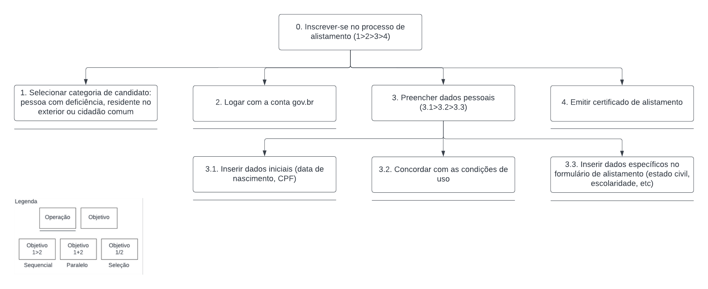
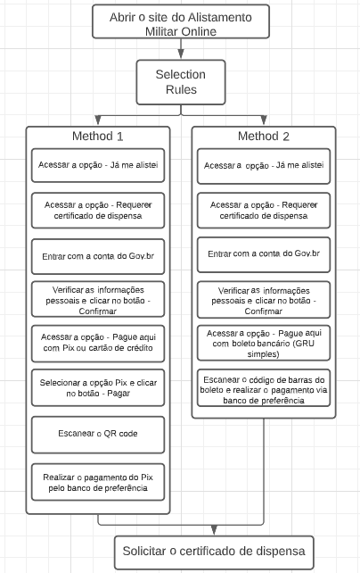

# Análise de Tarefas

## 1. Conceituação
>"Uma análise de tarefas é utilizada para se ter um entendimento sobre qual é o trabalho dos usuários, como eles o realizam e por quê. Nesse tipo de análise, o trabalho é definido em termos dos objetivos que os usuários querem ou precisam atingir" (BARBOSA e SILVA, 2011, p.191).

A questão central da análise de tarefas é definir - por meio de métodos de coleta, classificação e interpretação de dados - um desempenho satisfatório para um sistema e seus componentes, isto é, não se trata apenas de listar ações, mas compreender como um sistema de trabalho afeta o domínio de aplicação, e vice-versa.

A coleta de um conjunto de objetivos (psicológicos) das pessoas produz listas de ações realizadas (no mundo físico e através de sistema computacional) por um agente para alcançá-los. No entanto, independentemente da maneira como os dados para uma análise sejam coletados, haverá somente uma simulação das verdadeiras tarefas de interesse, devido ao número potencialmente abrangente de tarefas realizadas por diferentes pessoas e a limitação para obtenção de dados, de modo que estes estarão sempre incompletos (Diaper, 2003).

A análise de tarefas deve buscar identificar dados conflitantes e disparidade entre o relato oficial e a prática do trabalho através de informações obtidas em entrevistas, questionários, documentação e programas de treinamento e sistemas existentes.

Em posse disso, tendo em vista que o presente trabalho visa avaliar o desempenho de um sistema que já foi implementado, serão analisadas, de forma concreta e detalhada, duas tarefas amplamente utilizadas pela maioria dos usuários: alistar-se e acompanhar a situação do processo - utilizando a **Análise Hierárquica de Tarefas (HTA)**, e emitir o certificado de dispensa - por meio do GOMS **(Goals, Operators, Methods, and Selection Rules)**.

## 2. A Análise Hierárquica de Tarefas (HTA)
>"A Análise Hierárquica de Tarefas (HTA – Hierarchical Task Analysis) foi desenvolvida na década de 1960 para entender as competências e habilidades exibidas em tarefas complexas e não repetitivas, bem como para auxiliar na identificação de problemas de desempenho (Annett, 2003; Annett e Duncan, 1967). Ela ajuda a relacionar o que as pessoas fazem (ou se recomenda que façam), por que o fazem, e quais as consequências caso não o façam corretamente. Ela se baseia em psicologia funcional, e não comportamental, como eram as abordagens da época em que foi criada." (BARBOSA e SILVA, 2011, p.192)

Componentes importantes da HTA:

- Tarefa: qualquer parte do trabalho que precisa ser realizada, definida em termos de seus objetivos. Tarefas complexas são definidas em termos de objetivos e subobjetivos, num desdobramento hierárquico denominado decomposição de tarefas.
- Objetivo: estado específico de coisas, definido por um ou mais eventos ou por valores fisicamente observáveis. A HTA examina primeiramente os objetivos de alto nível, decompondo-os em subobjetivos, buscando identificar quais subobjetivos são mais difíceis de atingir (ou que geram mais erros) e que, portanto, limitam ou mesmo impedem o atingimento do objetivo maior.
- Plano: define os subobjetivos necessários para alcançar um outro objetivo maior, e a ordem em que esses subobjetivos devem ser alcançados. Os planos podem definir diversas relações entre os subobjetivos: sequência fixa, regra de seleção ou decisão, ou em paralelo.
- Operação: unidade fundamental na HTA (nível mais baixo da hierarquia de objetivos), especificada pelas circunstâncias nas quais o objetivo é ativado (input ou entrada), pelas atividades ou ações (actions) que contribuem para atingi-lo e pelas condições que indicam o seu atingimento (feedback).
- Ação: instrução para fazer algo sob certas circunstâncias. Pode ser vista formalmente como uma regra de transformação entre estados.

A HTA pode ser dada na forma textual (e. g., por meio de uma tabela) ou diagramas. Na segunda opção, utilizaremos a notação representação na Figura 1 abaixo:

 Figura 1: Elementos do diagrama (Fonte: Autores, 2023).

### 2.1. Análise da tarefa: inscrever-se no processo de alistamento

A tarefa "inscrever-se no processo de alistamento" é uma das principais que os usuários realizam no sistema, de acordo com o que foi identificado pelo perfil de usuário. A Tabela 1 e a Figura 2 exibem a HTA dessa tarefa em seu formato textual e via diagrama, respectivamente.

| Objetivos/Operações | Problemas e recomendações |
| - | - |
| 0. Inscrever-se no processo de alistamento. (1>2>3>4) | **input**: acesso pelo botão "Quero me alistar" na tela inicial. **feedback**: tela final com a opção de imprimir o certificado de alistamento.  **plano**: selecionar a categoria de candidato, logar com a conta gov.br, preencher dados pessoais e emitir o certificado de alistamento. **recomendação**: sincronizar as bases de dados do gov.br e serviço militar, para que não se torne exaustivo ao usuário inserir todas as suas informações pessoais. |
| 1. Selecionar categoria de candidato: pessoa com deficiência, residente no exterior ou cidadão comum. | |
| 2. Logar com a conta gov.br. | |
| 3. Inserir os dados pessoais. (3.1>3.2>3.3) | **plano**: inserir os dados iniciais, concordar com as condições de uso, e então prosseguir com dados específicos para o formulário de alistamento. |
| 3.1. Dados iniciais (data de nascimento, CPF). | |
| 3.2. Concordar com as condições de uso. | |
| 3.3. Dados espefícios para o formulário de alistamento. | |
| 4. Emitir o certificado de alistamento. | |

 Tabela 1: HTA para o objetivo "inscrever-se no processo de alistamento". (Fonte: autor, 2023).

 Figura 2: Diagrama HTA para o objetivo "inscrever-se no processo de alistamento". (Fonte: autor, 2023).

## 3. GOMS (Goals, Operators, Methods, and Selection Rules)
O GOMS é um método de analise de tarefas que concede a representação do conhecimento que é necessário para a realização de uma tarefa por parte de um usuário. Estão inclusos nessas representação: <b>goals</b> que são estruturas simbólicas que definem um estado de coisas a ser alcançado e determinam um conjunto de métodos possíveis pelos quais isso pode ser alcançado; <b>operators</b> que são as ações na qual o software permite com que o usuário execute e que estão relacionadas diretamente com o dispositivo em si; <b>methods</b> que são as sequências claras de goals e operators na qual possibilitam o usuário de concluir a tarefa; <b>selection rules</b> que são as regras que o usuário pode seguir para decidir qual método ele irá utilizar para atingir determinada meta (goal).

### 3.1. Análise da tarefa: solicitar o certificado de dispensa.
A tarefa de solicitar o cerificado de dispensa é uma parte importante dentro do site do Alistamento Militar Online, trata-se da parte final do processo de alistamento. Para efetuar a solicitação há apenas um caminho dentro do site, no entanto, antes de concluir, é necessário escolher a forma de pagamento para a emissão do documento, sendo assim, surge uma bifurcação antes de chegar na meta. Dessa maneira, é possível fazer uma análise de tarefas GOMS que parte da situação inicial para a <b>selection rules</b>, essa dá origem a dois <b>methods</b>, cada <b>method</b> possui seus <b>operators</b> específicos, ao final, ambos os <b>methods</b> convergem para uma <b>goal</b> em comum, ou seja, a meta final do processo.

Figura 3: Diagrama GOMS para o objetivo "solicitar o certificado de dispensa". (Fonte: autor, 2023).
  

## Bibliografia
BARBOSA, Simone; DINIZ, Bruno. Interação Humano-Computador. Editora Elsevier, Rio de Janeiro, 2010.

Análise de tarefas. Disponível em: <https://github.com/Interacao-Humano-Computador/2022.2-Lichess>. Acesso em 07 de abril de 2023. 

## Histórico de versão
| Versão | Data | Descrição | Autor(es) | Revisor(es) |
| --- | --- | --- | --- | --- |
|  `1.0`   | 07/05/2023 | Criação inicial do documento: conceitos iniciais e HTA | [Bruno Martins](https://github.com/gitbmvb) e [Gabriel Souza](https://github.com/GabrielMS00) | [João Barreto](https://github.com/JoaoBarreto03) e [Danilo Carvalho](https://github.com/Danilo-Carvalho-Antunes) |
|  `1.1`   | 07/05/2023 | Adição da análise GOMS | [Gabriel Souza](https://github.com/GabrielMS00) | [João Barreto](https://github.com/JoaoBarreto03) e [Danilo Carvalho](https://github.com/Danilo-Carvalho-Antunes) |
