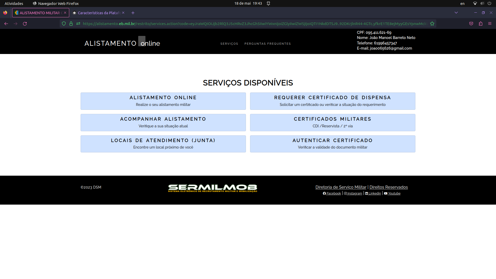
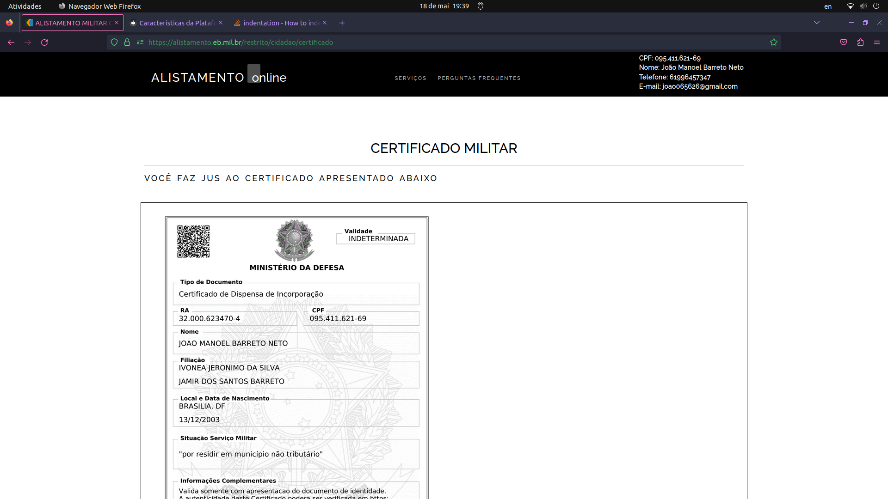
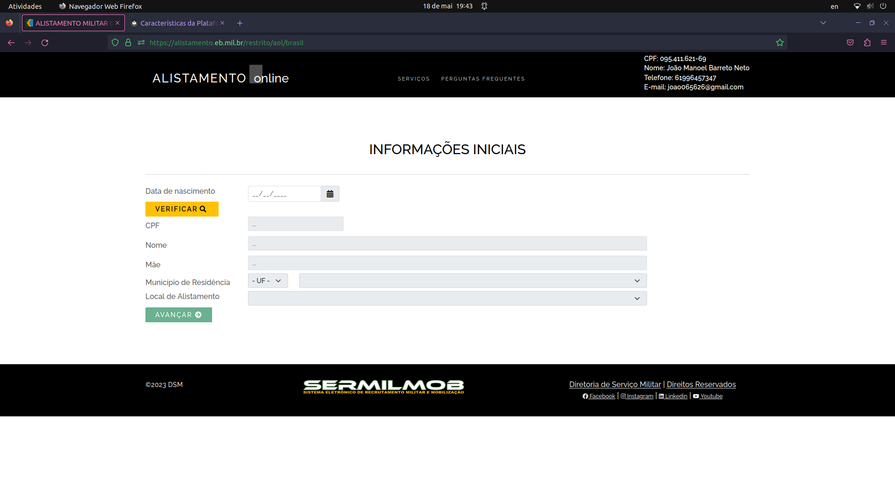

# Características da plataforma

## Introdução

Para a construção ou evolução de uma plataforma, é necessário inicialmente realizar uma análise das características, identificando as necessidades do usuário. Posteriormente, é construído (ou evoluído) o design dessa plataforma e a implementação de seus componentes, de acordo com o que foi levantado.

## Objetivo

Este tópico tem por objetivo listar as características do site Alistamento Militar e seus possíveis erros, para que seja possível propor melhorias para a página.

## Características

O site do Alistamento possui algumas funcionalidades, como:
    
+ Cadastro do usuário, feito pelo portal do GOV;

+ Realização do alistamento, por meio de um formulário;

+ Acompanhar alistamento;

+ Encontrar locais de atendimento mais próximos;

+ Emitir Certificado de Dispensa;

+ Emitir certificados militares - Certificado de Dispensa de Incorportação, Reservista e Segunda via de certificado;

+ Autenticar certificado - Verificar a validade de documento militar;

+ Encontrar perguntas frequentes.

### Analisando as características de design da plataforma:
+ A página inicial do site possui apenas dois simples botões, que são direcionados para páginas diferentes, mas que podem chegar no mesmo caminho;
+ O rodapé da página (Footer) com a logo dos criadores e contato;
+ Navbar com opção de perguntas frequentes;
+ Todos os dados do usuário aparecem na navbar.

 Figura 1: Página de Serviços do Alistamento Militar (Fonte: Autores, 2023).

## Características negativas e limitações

A partir das características analisadas, podem ser citados alguns erros, como:

+ O rodapé da página (Footer) não preenche toda tela e fica flutuando em todas as páginas, conforme a figura abaixo:

 Figura 2: Página de Serviços do Alistamento Militar - Tela inteira (Fonte: Autores, 2023).

+ Não há páginas separadas para aqueles que já se alistaram e os que ainda não;
+ Não existem explicações avançadas ao adentrar em um página, por meio dos botões;
+ Falta feedbacks sobre o processamento do alistamento;

 Figura 3: Página de Certificados (Fonte: Autores, 2023).

+ Note que não há privacidade quanto aos dados do usuário e eles aparecem em todas as telas;

+ Mesmo com o prazo de alistamento esgotado, ainda é possível entrar na opção de alistar;

 Figura 4: Página de Alistamento (Fonte: Autores, 2023).

+ O usuário em questão já havia se alistado e mesmo assim poderia acessar a página de alistamento novamente;
+ Note que o botão "Verificar" se refere ao CPF, mas este está posicionado em cima do campo de preenchimento desse dado;

+ Página com poucas informações sobre como funciona o alistamento e quais passos seguir;
+ Não há recursos de acessibilidade, uma vez que mesmo pessoas com algum tipo de problema deve-se apresentar para obter seu Certificado de  Dispensa. Logo, falta a opção de temas de alto contraste e teclas de atalho, por exemplo.

## Bibliografia
BARBOSA, Simone; DINIZ, Bruno. Interação Humano-Computador. Editora Elsevier, Rio de Janeiro, 2010.

## Histórico de versão
| Versão | Data | Descrição | Autor(es) | Revisor(es) |
| --- | --- | --- | --- | --- |
|  `1.0`   | 15/05/2023 | Criação inicial do guia de estilo | [Bruno Martins](https://github.com/gitbmvb) | [Arthur Augusto](https://github.com/arthur-augusto) |
|  `1.1`   | 15/05/2023 | Adicionando legenda à tabela de ícones | [Bruno Martins](https://github.com/gitbmvb) | [Gabriel Souza](https://github.com/GabrielMS00) e [Arthur Augusto](https://github.com/arthur-augusto) |
