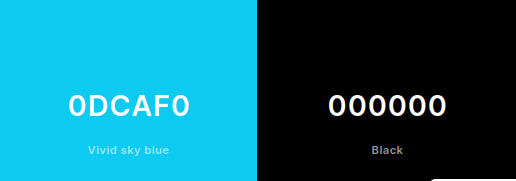

# Guia de Estilo
&emsp;&emsp;Conceitualmente, um **guia de estilo** é, em essência, um documento que agrega os princípios e as diretrizes adotadas em um projeto, no qual são registradas as principais decisões de design tomadas, a fim de que elas fiquem organizadas e sejam incorporadas no produto final de forma efetiva. Portanto, o guia de estilo auxilia na implementação do produto final e funciona como uma ferramenta de comunicação entre os membros da equipe de design e também com a equipe de desenvolvimento. Este documento, em especial, se refere ao *site* do [Alistamento Militar](https://alistamento.eb.mil.br/), o qual é o foco do projeto desenvolvido pelo grupo 05 de Interação Humano-Computador.

## 1. Introdução
### 1.1. Objetivo
&emsp;&emsp;Este documento visa apresentar o guia de estilo do projeto do *site* do [Alistamento Militar](https://alistamento.eb.mil.br/), fundamentando-se nas [Metas de Usabilidade](../analise_requisitos/metas_usabilidade.md) consoante o ciclo de vida para engenharia de usabilidade de Mayhew [1], tal como foi abordado no [Processo de Design](../planejamento/processo_design.md).

&emsp;&emsp;Serão analisados os seguintes elementos, no intuito de documentá-los e, a partir do entendimento, propor melhorias e, futuramente, dar prosseguimento ao projeto nas etapas de design, avaliação e desenvolvimento:

- Elementos de interface: Design de telas, visualização de informações, disposição espacial e grid (layout), elementos de interface (widgets), janelas, tipografia, símbolos, logo e cores;
- Elementos de interação: Estilos de interação, seleção de um estilo e aceleradores (teclas de atalho);
- Elementos de ação: Preenchimento de campos, seleção e ativação;

### 1.2. Organização e Conteúdo
&emsp;&emsp;O guia de estilo irá abordar os aspectos levantados no tópico *1.1*, seguindo a estrutura proposta por Mayhew.

1. Introdução
    - 1.1. Objetivo do guia de estilo
    - 1.2. Organização e conteúdo do guia de estilo
    - 1.3. Público-alvo do guia de estilos
    - 1.4. Como utilizar o guia?
    - 1.5. Como manter o guia?
2. Resultados de análise
    - 2.1. Descrição do ambiente de trabalho do usuário
3. Elementos de interface
    - 3.1. Disposição espacial e grid
    - 3.2. Tipografia
    - 3.3. Símbolos não tipográficos
    - 3.4. Cores
4. Elementos de interação
    - 4.1. Estilos de interação
5. Elementos de ação
    - 5.1. Preenchimento de campos
    - 5.2. Seleção
6. Vocabulário e padrões
    - 6.1. Terminologia
    - 6.2. Tipos de tela (para tarefas comuns)

### 1.3. Público-alvo
&emsp;&emsp;O público-alvo é constituído pelos membros do grupo 5 de Interação Humano-Computador, incumbidos da análise do site do Alistamento Militar, visando auxiliar no desenvolvimento posterior de etapas do projeto. Ademais, há também outros alunos da disciplina de IHC, desse semestre (2023.1) e de posteriores, que poderão se interessar pelo nosso projeto.

### 1.4. Como utilizar o guia?
&emsp;&emsp;O guia deve ser utilizado de maneira que atenda às necessidades do público-alvo em relação ao projeto da disciplina. Assim, ele pode ser recorrido para decisões e propostas de design relacionadas ao projeto, quer sejam de produção ou manutenção.

### 1.5. Como manter o guia?
&emsp;&emsp;O guia deve ser atualizado sempre que, por parte da equipe de design, uma decisão vier a modificar o projeto. Deste modo, o projeto e seus documentos estarão numa mesma padronização.

## 2. Resultados de análise
### 2.1. Descrição do ambiente de trabalho do usuário
&emsp;&emsp;Os usuários utilizam o site do Alistamento Militar através de um navegador web, em um computador pessoal ou dispositivo móvel.

## 3. Elementos de interface
### 3.1. Disposição espacial e grid
&emsp;&emsp;A tela do site do Alistamento Militar é responsiva (i.e., se adapta ao tamanho da tela do dispositivo utilizado) e composta basicamente por 3 seções:

- Superior (header): contém o título do site ("Alistamento online"), e um menu com dois itens (Serviços, Perguntas Frequentes).
- Central: varia de página para página. Nessa, em específico, há os botões com os diversos serviços disponíveis na plataforma.
- Inferior (footer): contém a logo da mantenedora do site (Serviço Eletrônico de Recrutamento Militar e Mobilização) e links úteis (Diretoria de Serviço Militar, Direitos Reservados, Redes Sociais, etc).

 A Figura 1 mostra a página de Serviços do site, acessada através de um computador pessoal.

 Figura 1: Página de Serviços do Alistamento Militar (Fonte: Autores, 2023).

### 3.2. Tipografia
&emsp;&emsp;O site utiliza somente uma única fonte textual para todas as páginas: **Raleway sans-serif**. A Figura 2 ilustra um exemplo de um texto escrito nesta fonte:

 Figura 2: Exemplo de texto utilizando a fonte Raleway sans-serif. (Fonte: Autores, 2023).

### 3.3. Símbolos não-tipográficos (ícones)
&emsp;&emsp;A Tabela 1 apresenta os ícones utilizados no site do Alistamento Militar, bem como suas respectivas descrições.

| Ícone | Descrição |
|:-----:|:---------:|
|  | **Facebook**: Link para o página de Facebook do site. |
|  | **Instagram**: Link para o página de Instagram do site. |
|  | **Linkedin**: Link para o página de Linkedin do site. |
|  | **Youtube**: Link para o canal do Youtube do site. |
|  | Subir para o topo da página. |

### 3.4. Cores
&emsp;&emsp;As duas únicas cores utilizadas são as seguintes (Figura 3):

- Preto (***#000000***): para textos, header e footer.
- Azul (***#0DCAF0***): para botões e links. 

 Figura 3: Paleta de cores utilizada no site. (Fonte: Autores, 2023).

## 4. Elementos de interação
### 4.1. Estilos de interação
&emsp;&emsp;O estilo de interação predominante no site do Alistamento Militar é o **comando direto**, pois o usuário interage diretamente com os elementos da interface, sem a necessidade de intermediários.

## 5. Elementos de ação
### 5.1. Preenchimento de campos
&emsp;&emsp;Apresentar um texto de descrição do campo, indicando o que deve ser inserido nele, é uma boa prática de usabilidade. Os campos devem ser preenchidos de acordo com o tipo de dado que se espera receber. Por exemplo, o campo "CPF" deve receber apenas números, e o campo "Nome" deve receber apenas letras. Além disso, os campos devem ser preenchidos de acordo com o padrão de escrita da língua portuguesa, ou seja, com a primeira letra de cada palavra em maiúsculo, e as demais em minúsculo.
&emsp;&emsp;É importante especificar se o campo é obrigatório ou não. Caso seja, deve-se indicar isso ao usuário, seja através de um asterisco (*) ao lado do nome do campo, ou através de um texto indicando que o campo é obrigatório.

### 5.2. Seleção e ativação de itens
&emsp;&emsp;A seleção de um item deve ser feita através de um clique no item desejado. O item selecionado deve ser destacado, para que o usuário saiba qual item está selecionado. Além disso, deve-se indicar ao usuário que ele pode selecionar apenas um item, ou mais de um item. &emsp;&emsp;Por exemplo, se o usuário pode selecionar apenas um item, deve-se utilizar um botão de rádio. Se o usuário pode selecionar mais de um item, deve-se utilizar uma caixa de seleção.

## 6. Vocabulário e padrões
### 6.1. Terminologia
&emsp;&emsp;A terminologia utilizada no site deve ser simples e de fácil compreensão. Deve-se evitar o uso de termos técnicos, e, caso seja necessário, deve-se explicar o significado do termo. Além disso, deve-se utilizar a mesma terminologia em todo o site, para que o usuário não se confunda. Por exemplo, se o site utiliza o termo **Refratário**, deve esclarecê-lo aos usuários sobre o seu significado - *"O brasileiro que não se apresentar para a seleção durante a época de seleção do contingente de sua classe ou que, tendo-o feito, se ausentar sem a ter completado, será considerado refratário."*

### 6.2. Tipos de tela (para tarefas comuns)
As telas devem ser construídas consoante os padrões especificados nos Elementos de interface de disposição espacial e grid.

## Bibliografia
BARBOSA, Simone; DINIZ, Bruno. Interação Humano-Computador. Editora Elsevier, Rio de Janeiro, 2010.

## Histórico de versão
| Versão | Data | Descrição | Autor(es) | Revisor(es) |
| --- | --- | --- | --- | --- |
|  `1.0`   | 15/05/2023 | Criação inicial do guia de estilo | [Bruno Martins](https://github.com/gitbmvb) | [Arthur Augusto](https://github.com/arthur-augusto) |