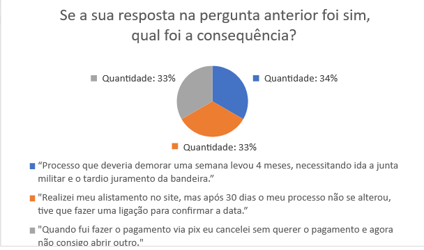

# Perfil do Usuário

## 1. Conceito

> Perfil de usuário é uma descrição detalhada das características dos usuários cujos objetivos devem ser apoiados pelo sistema sendo projetado. [...], devemos identificar as características de interesse (e.g., cargo, função, experiência, nível de instrução, atividades principais, faixa etária etc.) e conduzir um estudo (e.g., através de entrevistas e questionários) para coletar os dados dos usuários. (Interação Humano-Computador - Bruno Santana da Silva e Simone Diniz Junqueira Barbosa, p. 174)

Para entendermos melhor o usuário, primeiro é necessário sabermos quem são eles, e quais são os seus objetivos na hora de usar o nosso sistema. Podemos coletar os dados diretamente do nosso usuário a partir de um questionário, com perguntas que irão nos auxiliar a conhecer melhor para quem irá utilizar a aplicação, e tão importante quanto, quem é o tipo de pessoa que *não* irá utilizá-la.

## 2. Quais dados coletar?

Nos coletamos dados demográficos e pessoais sobre o usuário, e além disso, perguntamos sobre sua relação com computadores e as tecnologias que ele tem acesso, conectividade com a internet, seu interesse sobre o serviço militar e opiniões sobre o site do alistamento militar. Essas são informações bastante úteis para construirmos personas e, consequentemente, conhecermos melhor o nosso usuário.

## 3. Questionário

1. Qual a sua idade?
    - 17
    - 18
    - 19

3. Qual o seu nível de experiência com computadores?
    - Pouca experiência
    - Média experiência
    - Muita experiência

4. Você possui celular (Smartphone)?
    - Sim
    - Não

5. Você possui computador pessoal?
    - Sim (Desktop)
    - Sim (Notebook)
    - Não

6. Possui acesso à Internet em sua moradia?
    - Sim
    - Não

7. Possui rede móvel?
    - Sim
    - Não

8. Você já precisou usar o site do alistamento militar?
    - Sim
    - Não
    - Pretendo

9. Você possui interesse no serviço militar?
    - Sim
    - Não

10. Você já realizou o processo de alistamento militar?
    - Sim
    - Não
    - Estou realizando

11. Você já foi prejudicado pelo site de alguma forma?
    - Sim
    - Não

12. Se a sua resposta na pergunta anterior foi sim, qual foi a consequência?

13. Para cada a adjetivos a seguir, marque o valor correspondente à sua opinião sobre a página do site de alistamento militar.

    |            | Pouco | Razoavelmente | Muito |
    | ---------- | ----- | ------------- | ----- |
    | Atraente   | - | -           | -   |
    | Clara      | - | -           | -   |
    | Útil       | - | -           | -   |
    | Organizada | -   | -           | -   |
    | Objetiva   | -   | -           | -   |

## 4. Estatísticas do Questionário

Aplicamos o questionário de forma presencial para 20 voluntários. Focamos a aplicação para pessoas de 17 a 19 anos do sexo masculino.

1. Qual a sua idade?

    
    
    **Figura 1:** Gráfico da idade dos participantes da pesquisa. (Fonte: BARRETO, João; 2023).

2. Qual o seu nível de experiência com computadores?

    

    **Figura 2:** Gráfico do nível de experiência dos participantes com computadores. (Fonte: BARRETO, João; 2023).

3. Você possui celular (Smartphone)?

    

    **Figura 3:** Gráfico dos participantes que possuem ou não celular. (Fonte: BARRETO, João; 2023).

4. Você possui computador pessoal?

    

    **Figura 4:** Gráfico dos participantes que possuem ou não computador pessoal. (Fonte: BARRETO, João; 2023).

5. Você possui acesso à Internet em sua moradia?

    

    **Figura 5:** Gráfico dos participantes que possuem ou não acesso à internet. (Fonte: BARRETO, João; 2023).

6. Possui rede móvel?

    

    **Figura 6:** Gráfico dos participantes que possuem ou não rede móvel. (Fonte: BARRETO, João; 2023).

7. Você já precisou usar o site do alistamento militar?

    

    **Figura 7:** Gráfico dos participantes que precisaram ou não utilizar o site do alistamento militar. (Fonte: BARRETO, João; 2023).

8. Você possui interesse no serviço militar?

    

    **Figura 8:** Gráfico dos participantes que precisaram ou não utilizar o site do alistamento militar. (Fonte: BARRETO, João; 2023).

9. Você já realizou o processo de alistamento militar?

    

     **Figura 9:** Gráfico dos participantes que realizaram ou não o processo de alistamento militar. (Fonte: BARRETO, João; 2023).

10. Você já foi prejudicado pelo site de alguma forma?

    

     **Figura 10:** Gráfico dos participantes que foram prejudicaso pelo site do alistamento militar. (Fonte: BARRETO, João; 2023).

11. Se a sua resposta na pergunta anterior foi sim, qual foi a consequência?

    

     **Figura 11:** Gráfico das consequências citadas pelos participantes, devido a problemas no site do alistamento militar. (Fonte: BARRETO, João; 2023).

12. Para cada a adjetivos a seguir, marque o valor correspondente à sua opinião sobre a página do site de alistamento militar:

    

     **Figura 12:** Gráfico da avaliação das características do site pelos participantes da pesquisa. (Fonte: BARRETO, João; 2023).

## Referências 
>BARBOSA, S. D. J.; SILVA, B. S. Interação Humano-Computador. Rio de Janeiro: Elsevier, 2011.

## Histórico de versão
| Versão | Data | Descrição | Autor(es) | Revisor(es) |
| --- | --- | --- | --- | --- |
|  `1.0`   | 08/05/2023 | Criação inicial do documento | [Arthur Augusto](https://github.com/arthur-augusto) e [Danilo Carvalho](https://github.com/Danilo-Carvalho-Antunes) | [Bruno Martins](https://github.com/gitbmvb) e [João Barreto](https://github.com/JoaoBarreto03) |
|  `1.1`   | 26/06/2023 | Adicionando gráficos e corrigindo erros do documento | [João Barreto](https://github.com/JoaoBarreto03) | [Bruno Martins](https://github.com/gitbmvb)|