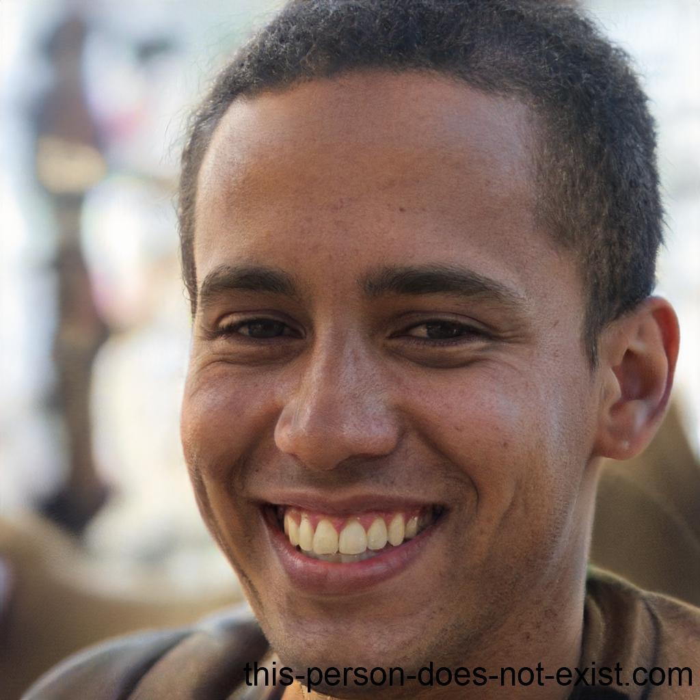

# Personas 
## 1. Introdução
>"Os modelos são usados nas ciências naturais e sociais para representar fenômenos complexos com uma abstração útil. Assim como os economistas criam modelos para descrever o comportamento dos mercados e os físicos criam modelos para descrever o comportamento das partículas, temos
descobrimos que usar nossa pesquisa para criar modelos descritivos de nossos usuários é uma
ferramenta poderosa para design de interação. Chamamos esses modelos de usuário de personas." (About Face 3 The Essentials of  Interaction Design Alan Cooper, Robert Reimann, and Dave Cronin ,p.75).

Personas são personagens com características próprias, que simulam os usuários de dado produto. A partir das personas, é possível criar um roteiro que permite um melhor entendimento das funcionalidades deste produto.

Para criar um produto que deve satisfazer um público diversificado de usuários, a lógica pode dizer
você para torná-lo tão amplo em sua funcionalidade quanto possível para acomodar os mais
pessoas. Essa lógica, no entanto, é falha. A melhor maneira de acomodar com sucesso um
variedade de usuários é projetar para tipos específicos de indivíduos com necessidades específicas.
A chave para essa abordagem é primeiro escolher as pessoas certas para as quais projetar -
aqueles usuários cujas necessidades representam melhor as necessidades de um conjunto maior de constituintes-chave
e então priorizar esses indivíduos para que as necessidades do
os usuários mais importantes são atendidos sem comprometer nossa capacidade de atender às necessidades
de usuários secundários.

Personas fornecem uma ferramenta poderosa para comunicar sobre diferentes tipos de usuários e suas necessidades, decidindo quais usuários são os mais importantes.
importante visar no design de forma e comportamento.

## 2. Metodologia

A persona foi construida por meio da pesquisa do [perfil do usuário](perfil_do_usuario.md) e por meio da pesquisa e dos diferentes tipo de usários foram feitos personas ficticias na expectativa de representar casos reais sem serem relacionados a pessoas específicas.
Por meio da video aula <Interfaces Humano-Computador - Mapas de empatia e personas> feita pela universidade UNIVESP foi feito um embasamento sobre como as personas devem ser construídas.

## 3. Personas Primárias:

### 3.1. Carlito Pereira da Lima, Estudante de Engenharias - UnB campo Gama.

 Figura 1: Carlito. (Fonte: this-person-does-not-exist.com; 2023).

#### 3.1.1. Fatos e dados demográficos

- Sexo masculino.
- Mora com os pais no bairro FET.
- Mora a 15Km de distancia da universidade.
- Solteiro.
- 18 anos.
- Primeiro semestre do curso de engenharias.
- Possui um celular e computador.
- Não trabalha nem estagia.

#### 3.1.2. Comportamento

Seu passatempo são jogos online, que joga no seu computador todo dia um
pouco, depois dos estudos da universidade. É uma pessoa extremamente
competitiva, sempre gostou de tecnologia sua vida toda, é rodeado de
Personas. 2
amigos e sempre pontual com as responsabilidades. Não possui animais de
estimação.
Fez 18 anos recentemente, não possui interesse no serviço militar e já
realizou o processo de alistamento militar. 

#### 3.1.3. Necessidade e Metas

Entrou na universidade querendo ser engenheiro de software.
Pretende ser um dos melhores na sua futura profissão e também no seu
hobbie.
Deseja ser um dos melhor aluno da sala.
Esta tentando construir um circulo de amizades com os colegas de
sala/curso.
Busca conseguir um estagio o quanto antes.

#### 3.1.4. Impressões do site de alistamento militar

Já possuiu problemas ao utilizar o site, problema de pagamento e de
agendamento.
Por gostar de tecnologia possui suas opiniões forte sobre o site como, não
acha a interface do site agradável e nem clara, mas acha o site útil e
objetivo, porem um pouco confuso.

### 3.2. Natan Passiante Ferreira , Estudantede Engenharias - UnB campo Gama e Aprendiz de Mecânico.

 Figura 2: Natan. (Fonte: this-person-does-not-exist.com; 2023).

#### 3.2.1. Fatos e dados demográficos

- Sexo masculino.
- Mora com a mãe no bairro TEF.
- Mora a 6Km de distancia da universidade.
- Casado.
- 19 anos.
- Primeiro semestre do curso de engenharias.
- Possui um celular e computador.
- Trabalha e estuda.
- Possui um salario de 947,00 como aprendiz de mecânico.

#### 3.2.2. Comportamento

Seu passatempo é mexer em carros antigos na oficina do seu tio. Trabalha
das 8h as 12h e depois vai o para universidade. É uma pessoa
extremamente alegre, sempre gostou de carros sua vida toda, é solitário e
sua melhor companhia é o seu carro e sua esposa. Possui animais de
estimação, um salsicha chamado Brutus que tem 2 anos e meio.
Fez 19 anos recentemente, não possui interesse no serviço militar e já
realizou o processo de alistamento militar. 

#### 3.2.3. Necessidade e Metas

Entrou na universidade querendo ser engenheiro automotivo.
Pretende ter um bom salario para ter a sua própria casa e viver com sua
família.
Deseja se formar antes dos 25 pois sabe que será difícil conciliar o trabalho
com a universidade.
Busca conseguir uma oficina o quanto antes.

#### 3.2.4. Impressões do site de alistamento militar

Não possuiu nem um problema ao utilizar o site embora demorou um pouco
para entender como o site funcionava. Nunca se considerou um cara ligado
a tecnologia e por isso acha que o site possui características razoáveis para
o que ele deveria ter, nada fora da curva mas também nada que seja ruim
sobre a utilização do site.

### 3.3. João Henrique Gomes, trabalha em uma empresa de telefonia como atendente

 Figura 3: João. (Fonte: this-person-does-not-exist.com; 2023).

#### 3.3.1. Fatos e dados demográficos

- Sexo Masculino;
- Mora com os pais em uma casa em Brasília;
- Ensino Médio Completo;
- 18 anos;
- Trabalha em uma empresa de telefonia como atendente de telemarketing;
- Gosta bastante de tecnologia;

#### 3.3.2. Comportamento

Tendo completado seu ensino médio recentemente, João é um jovem bastante sonhador, que mal completou 18 anos e já quis começar a trabalhar. Apaixonado por tecnologia, ele conseguiu uma vaga de emprego em uma empresa de telefonia, para trabalhar com aquilo que gosta. Passar o dia em um computador e atendendo às chamadas por telefone parece ser exaustivo para muitos, mas para João é uma alegria imensa, mesmo seu dia sendo muito corrido.

#### 3.3.3. Necessidades e Metas

João está muito empolgado e passa o dia inteiro atendendo chamadas, sem se preocupar com mais nada, nem com ele mesmo. Antes mesmo de fazer 18 anos, João já havia se alistado pelo site do Alistamento Militar, mas utilizou-o uma única vez e nunca mais acessou. O jovem só pensa agora em concluir sua inúmeras metas, sendo elas:

- Tirar a carteira de motorista;
- Comprar um carro;
- Obter sua reservista.

No entanto, para obter a reservista, João ainda precisa comparecer a uma junta militar e ele não sabe onde fica. Sua esperança é encontrar no site do alistamento um campo para buscar os locais de atendimento mais próximos.

#### 3.3.4. Impressões do site de alistamento militar:

Ao adentrar no site do alistamento militar, João encontrou um botão para buscar locais de atendimento e conseguiu encontrar uma junta militar próxima de sua casa de forma rápida e objetiva.

### 3.4. Lucas Teles Silva, recém formado no ensino médio à procura de um emprego

 Figura 3: Lucas. (Fonte: this-person-does-not-exist.com; 2023).

#### 3.4.1. Fatos e dados demográficos

- Sexo masculino;
- Ensino médio completo;
- 18 anos;
- Mora com os pais em uma cidade do Estado de Goiás;
- Possui um celular e um computador;
- Utiliza a tecnologia para as atividades cotidianas.

#### 3.4.2. Comportamento

Lucas é um jovem que acabou de se formar no ensino médio e está muito feliz, depois de tantos anos de estudo. Lucas não acha que é a hora de entrar em uma faculdade e prefere procurar um emprego. Para isso, o jovem sabe que necessita estar sem débitos com o serviço militar, caso contrário ele não será contratado. Por esse motivo, ele já iniciou o processo de alistamento pelo site do Alistamento Militar Online.

#### 3.4.3. Necessidades e metas

Lucas possui como necessidade principal estar preparado para assumir uma vaga de emprego e para isso ele precisa estar com todos os documentos em mãos, inclusive seu Certificado de Dispensa de Incorporação (CDI). Como metas, o jovem não vê a hora de receber seu primeiro salário, juntar dinheiro e comprar o celular novo que ele tanto quer, por conta de uma câmera quádrupla que possui uma qualidade extraordinária.

#### 3.4.4. Impressões do site de alistamento militar:

Lucas alistou-se utilizando o site do Alistamento Militar Online e não utilizou ele novamente. Mesmo assim, ele achou fácil dar entrada em seu processo sem precisar sair de casa e ficou impressionado com a quantidade de funcionalidades que o site possui.

## 4. Persona Secundária

### 4.1. Pedro Brener Silva, Analista de Recursos Humanos de uma grande Oficina Automotiva

 Figura 2: Natan. (Fonte: this-person-does-not-exist.com; 2023).

#### 4.1.1. Fatos e dados demográficos:

- Sexo Masculino;
- Mora em um apartamento com a esposa em Brasília;
- Formado em Recursos Humanos
- 30 anos;
- Trabalha em uma grande oficina mecânica em Brasília especializada na manutenção e restauração de carros antigos,
- Bastante adepto a tecnologia.

#### 4.1.2. Comportamento

Pedro é bastante focado em seus treinos e no trabalho. Acorda cedo todos os dias para ir à academia e em seguida vai para a oficina em que trabalha. Após ter concluído o ensino médio, Pedro se interessou muito pela área de recursos humanos e graduou-se nela. Ele também gostava bastante de carros e por esse motivo procurou um emprego que unisse sua graduação com sua paixão, sendo analista de RH em uma oficina automotiva.

#### 4.1.3. Necessidades e metas

Todos os dias, Pedro faz uma análise dos candidatos para vagas de estágio na oficina, uma vez que a empresa é muito grande e possui várias unidades, incluindo a Sede, a qual ele trabalha. Sua principal necessidade é escolher estagiários bons, que realmente querem aprender e colaborar com a empresa, prestando um serviço de qualidade e para isso ele precisa verificar vários documentos dos candidatos, inclusive o Certificado de Dispensa de Incorporação (CDI), gerado após o processo de alistamento dos jovens.

Suas metas incluem:

- Trabalhar na empresa até se tornar Gerente de Recursos Humanos;
- Reformar seu apartamento;
- Poder restaurar o carro antigo que seu pai tanto gosta;
- Conhecer o máximo de países que conseguir.

#### 4.1.4. Impressões do site de alistamento militar:

Por já ter se alistado há um bom tempo atrás, Pedro quer utilizar o site para verificar a autenticidade de certificados e ficou feliz ao ter encontrado uma funcionalidade que possibilite-o a fazer isso no site, sem ter nenhum problema.

## 5. Antipersona
### 5.1. Natalia Amaral Silva, Estudante de Medicina - UnB campo Darcy Ribeiro.

 

 Figura 3: Natalia . (Fonte: this-person-does-not-exist.com; 2023).

  
#### 5.1.1. Fatos e dados demográficos

- Sexo Feminino.
- Mora com o pai no bairro EFT.
- Mora a 25Km de distancia da universidade.
- 18 anos.
- Primeiro semestre do curso de medicina.
- Possui um celular e computador.
- Apenas estuda.

#### 5.1.2. Comportamento

Seu passatempo é ler livros de romance. Estuda das 8h as 20h na universidade. É uma pessoa extremamente alegre, sempre gostou da área medica, sua melhor companhia é o seu cachorro, titi um pitbull que tem 5 anos.
Fez 18 anos recentemente, não possui interesse no serviço militar e não realizará o processo de alistamento militar.  

#### 5.1.3. Necessidade e Metas

Entrou na universidade querendo ser neurocirurgiã.
             
Pretende ter um bom salario para ter a sua própria casa e viver com sua família.
Deseja começar a trabalhar assim que possível.

#### 5.1.4. Impressões do site de alistamento militar
Não possui nenhuma interação com o site de alistamento militar pois é do sexo feminino e o site é apenas para pessoas do sexo masculino.
  

## Bibliografia

>COOPER, Alan. The Inmates Are Running the Asylum: Why High Tech Products Drive Us Crazy and How to Restore the Sanity (2nd Edition). Sams Publishing, 1999.

>Videoaula - Interfaces Humano-Computador - Aula 04 - Estudos de usuário. Disponível em: https://www.youtube.com/watch?v=hWLDkRo52SI&feature=youtu.be&t=49 Acesso em: 03/07/2023

## Histórico de versão
| Versão | Data | Descrição | Autor(es) | Revisor(es) |
| --- | --- | --- | --- | --- |
|  `1.0`   | 14/05/2023 | Criação inicial do documento | [Arthur Augusto](https://github.com/arthur-augusto) e [Danilo Carvalho](https://github.com/Danilo-Carvalho-Antunes) | [Bruno Martins](https://github.com/gitbmvb) e [João Barreto](https://github.com/JoaoBarreto03) |
|  `1.1`   | 03/07/2023 | Criação de mais 3 personas e formatação da página | [João Barreto](https://github.com/JoaoBarreto03) | [Bruno Martins](https://github.com/gitbmvb) |
|  `1.2`   | 03/07/2023 | Adicionando imagens nas personas que faltavam | [João Barreto](https://github.com/JoaoBarreto03) | [Bruno Martins](https://github.com/gitbmvb) |

