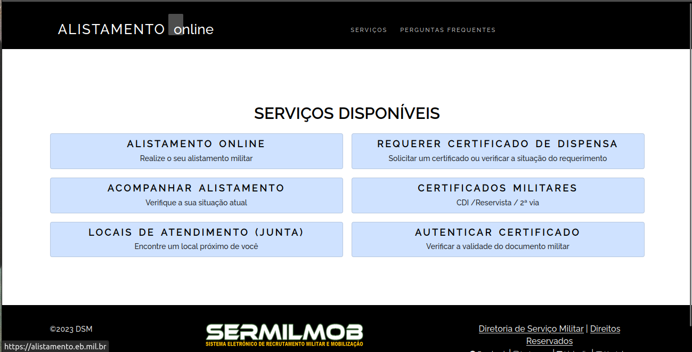
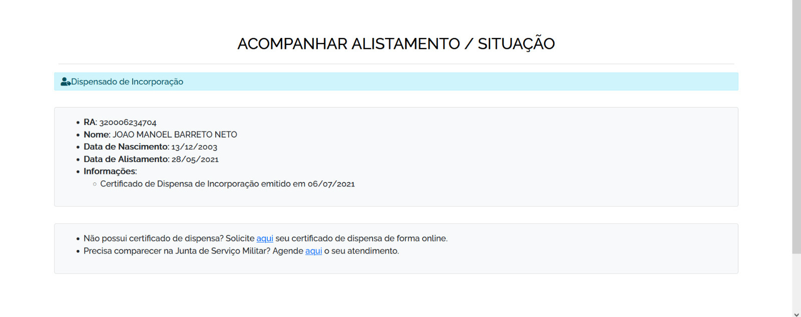
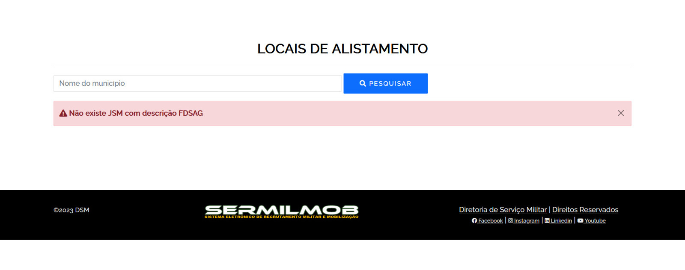

# Princípios Gerais do Projeto

## Introdução

Os Princípios Gerais do Projetos são uma série de diretrizes que são de extrema importância na construção de sistemas utilizados em IHC [1], que estão relacionados aos tópicos seguintes.

## Expectativas dos Usuários

Esse princípio visa atender a todas as expectativas do usuário quanto a interface do projeto. As ações do sistema e as funcionalidades apresentadas devem ser claras e objetivas, direcionando o usuário para determinada finalidade, sem gerar confusão. No site do Alistamento Militar, o usuário espera ter um conteúdo que explique quais os passos ele deve seguir para conseguir realizar um cadastro no GOV e posteriormente realizar o alistamento. Após a conclusão dessas tarefas, o usuário precisa ter um direcionamento para onde ele deve ir, quanto tempo esperar, e como emitir os certificados. 

## Simplicidade

Para que o usuário consiga executar tarefas em um sistema sem dificuldades, surge o princípio da simplicidade. As tarefas consideradas complexas demais são inovadas, por meio de abordagens tecnológicas que vão desde um tutorial para ensinar o usuário a realizar determinada atividade, até a automação desta tarefa, sem reduzir a capacidade de trabalho próprio do usuário, isto é, aquele trabalho que não depende da tecnologia. No caso do site de Alistamento Militar, mesmo com a simplicidade do site, tarefas como emitir certificados deveriam ocorrer de forma separada e explicativa, por exemplo:

**Figura 1:** Página principal do site do Alistamento Online  (Fonte: Alistamento Online; 2023).

Ao adentrar na aba de emitir certificado, não há opção de escolher um certificado, nem saber qual deles já estão disponíveis, uma vez que ele gera apenas o certificado que está disponível e não retorna um Feedback sobre os outro, se eles estão em análise ou não.

## Equilíbrio e Liberdade

O usuário deve ter um certo equilíbrio com relação a liberdade de utilização de um sistema. Por esse motivo, é necessário que haja uma série de opções que orientem o usuário em suas escolhas, para que ele não se perca. No entanto, caso o usuário queira explorar uma nova funcionalidade, os cenários devem possibilitar sua chegada até ela, levando em consideração o nível de experiência do usuário.
No caso do Alistamento Militar, a página permite que o usuário explore o site de diversas formas. No entanto, o que aparece para o usuário que não se alistou é o mesmo para aquele que já realizaou essa tarefa, permitindo que o mesmo usuário faça uma alistamento para outra pessoa, por exemplo. Isso deveria ser limitado de certa forma. 

## Consistência e Padronização

A construção de um sistema deve ser realizada de acordo com padrões que devem ser seguidos em todas as partes do sistema. Alguns exemplos de estruturas que devem ser padronizadas são: layout, visualização de informações, ações e seus resultados. Além disso, elementos de interface que possuem funcionalidades diferentes devem ser facilmente distinguidos, mantendo a consistência do sistema. No caso do site do alistamento, o cadastro do usuário não segue um padrão, porque a estrutura do cadastro GOV é diferente daquele realizado no Alistamento Militar. 

**Figura 2:** Processo de cadastro/login do site gov.br(Fonte: gov.br; 2023).

**Figura 3:** Processo de alistamento no site do Alistamento Online (Fonte: Alistamento Online; 2023).

## Eficiência e Antecipação do Usuário

O princípio da eficiência visa garantir ao usuário a interação do sistema, mesmo em situações em que há a necessidade de esperar um processamento, não interrompendo o usuário em seu trabalho. Além disso, é de extrema importância que o sistema não repita perguntas de orientação, ou seja, uma vez respondida, o sistema deve guardar aquela informação para não incomodar o usuário novamente.
Aliado a isso, surge o princípio da antecipação, que oferece ao usuário informações e ferramentas necessárias para determinado processo, sem que o próprio utilizador busque por elas, impactando positivamente a eficiência do sistema.
No caso do Alistamento Militar, não há a antecipação do usuário quanto ao passo a passo que ele deve seguir para conseguir realizar o cadastro e o alistamento. O usuário pode acessar qualquer área da página, que deveria seguir uma linearidade na disponibilização das funcionalidades.

## Visibilidade e Reconhecimento

Esse princípio auxilia na clareza e na objetividade de um sistema. Ao executar determinada ação, deve estar explícito para o usuário quais as opções que ele pode escolher para prosseguir naquela ação. É importante ressaltar que aquelas ações que não correspondem ao que o usuário deseja não deve aparecer.

Com base nas ações realizadas pelo usuário, o sistema deve retornar mensagens informando o que está acontecendo e se a ação foi efetivada ou não, permitindo o reconhecimento de cada ação por parte do usuário, sem dar uma impressão de que o sistema não está respondendo.
O site do alistamento deve retornar uma mensagem informando que o cadastro foi realizado e que o usuário deve visitar o site frequentemente para acompanhar o status do alistamento. Além disso, ao clicar na parte de acompanhamento, é necessário que o site apresente em qual parte do processamento o usuário está e quais etapas já foram realizadas.

**Figura 3:** Página de acompanhamento no site do Alistamento Online (Fonte: Alistamento Online; 2023).

## Conteúdo Relevante

Os conteúdos relevantes para os usuários devem estar apresentados de forma clara, sem apresentar informações inúteis ou pouco relevantes. Dessa forma, mensagens de instrução e ajuda, devem ser escritas de forma direta e livre de ambiguidades, assim como o rótulo de menus e botões. Além disso, os textos devem ser legíveis e apresentados em alto contraste. Outro fator importante é a utilização de cores secundárias claras para permitir uma maior inclusão para aquelas pessoas que não conseguem distinguir as cores.

A página do Alistamento Militar não apresenta as informações relevantes na tela de forma clara, há apenas palavras-chave a serem acessadas, mas não há explicações. Além disso, não há uma paleta de cores padronizada e nem tema de alto contraste para incluir mais pessoas.

## Projeto para Erros

Esse princípio tem por objetivo permitir ao usuário identificar determinado erro e resolvê-lo de alguma forma, a partir de uma informação dada pelo sistema. No entanto, prevenir os erros é mais recomendado do que tratá-los posteriormente.

No site do Alistamento, as mensagens de erro não são tão claras, nem todas possui uma orientação sobre o que se deve fazer.

**Figura 3:** Mensagem de erro na página de Locais de Atendimento no site do Alistamento Online (Fonte: Alistamento Online; 2023).

## Conclusão

Dessa forma, percebe-se que para a construção de um projeto, deve ser levado em consideração diversos princípios que atendam da melhor forma possível as necessidades do usuário. Assim, descrever todos esses princípios facilita a percepção daquilo que deve ser entregue e modificado para obter a satisfação do usuário. 

## Referências 
>BARBOSA, S. D. J.; SILVA, B. S. Interação Humano-Computador. Rio de Janeiro: Elsevier, 2011.

## Histórico de versão
| Versão | Data | Descrição | Autor(es) | Revisor(es) |
| --- | --- | --- | --- | --- |
|  `1.0`   | 08/05/2023 | Criação inicial do documento | [Danilo Carvalho](https://github.com/Danilo-Carvalho-Antunes) e [João Barreto](https://github.com/JoaoBarreto03) | [Bruno Martins](https://github.com/gitbmvb) |
|  `1.1`   | 18/06/2023 | Adição de novas imagens e legendas com fonte | [João Barreto](https://github.com/JoaoBarreto03) | [Bruno Martins](https://github.com/gitbmvb) |