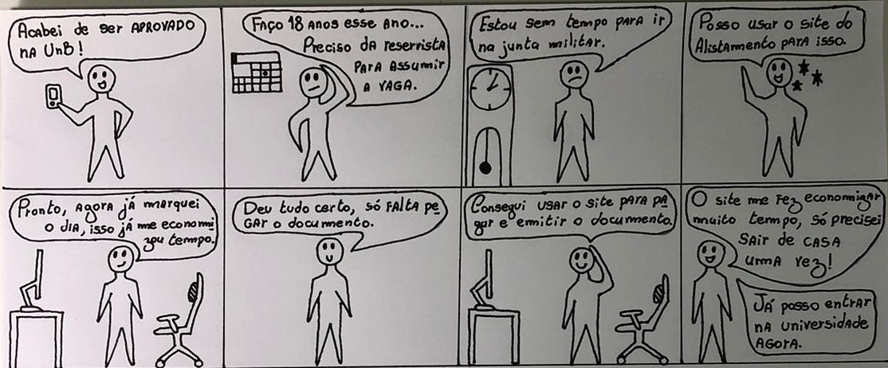
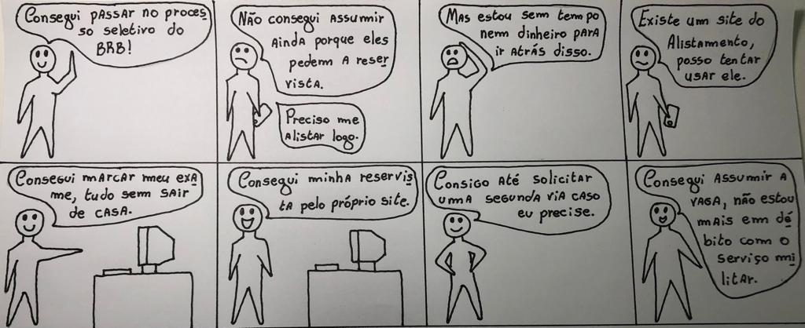
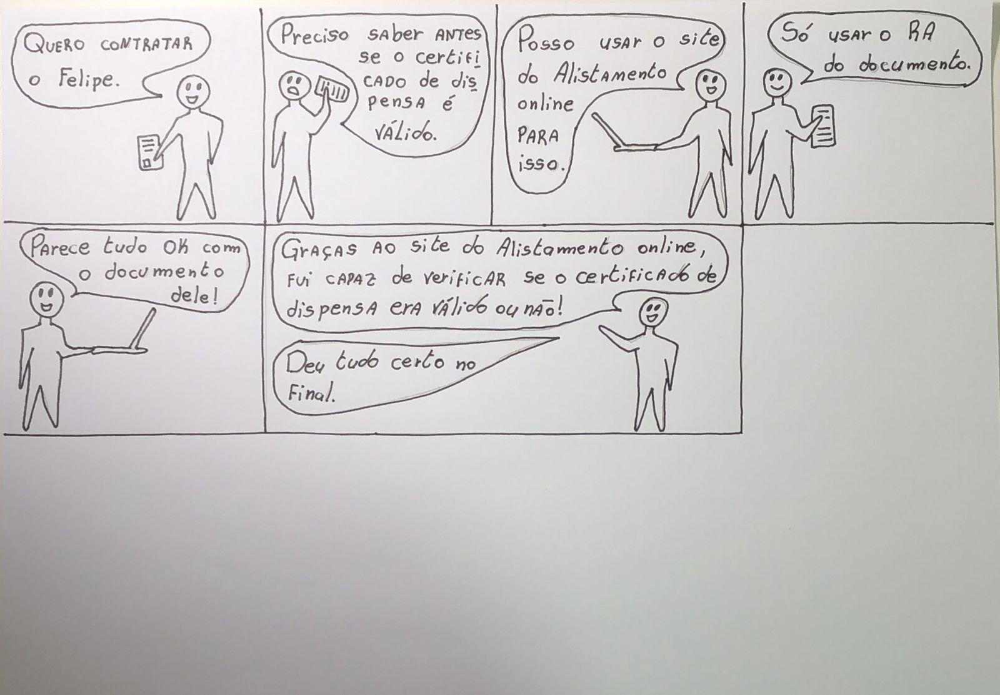
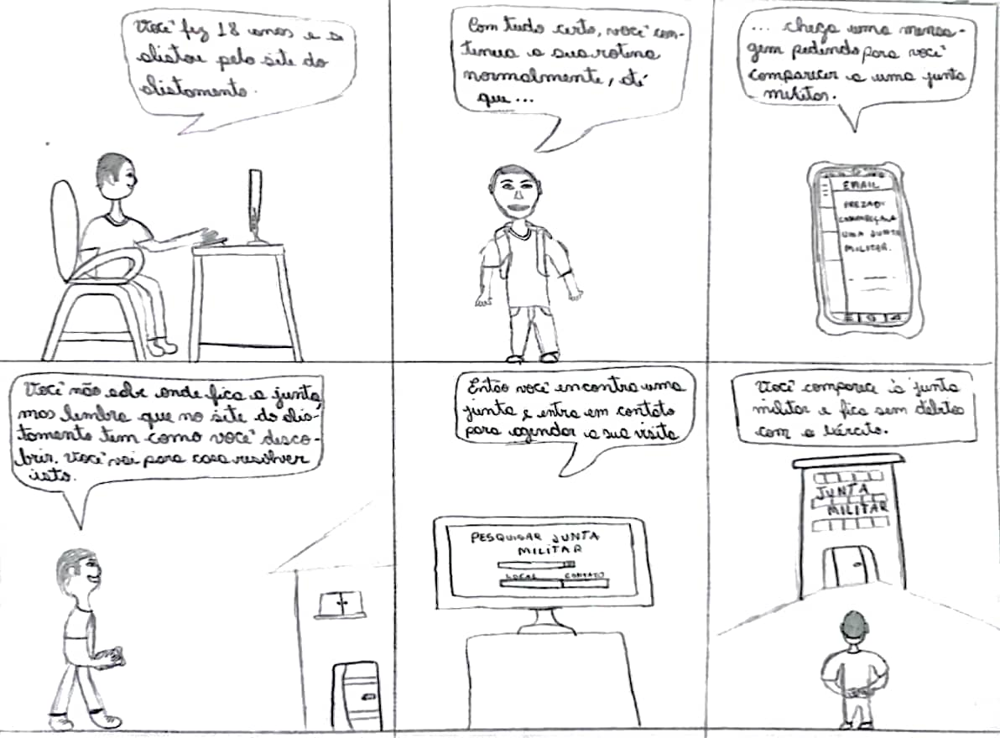
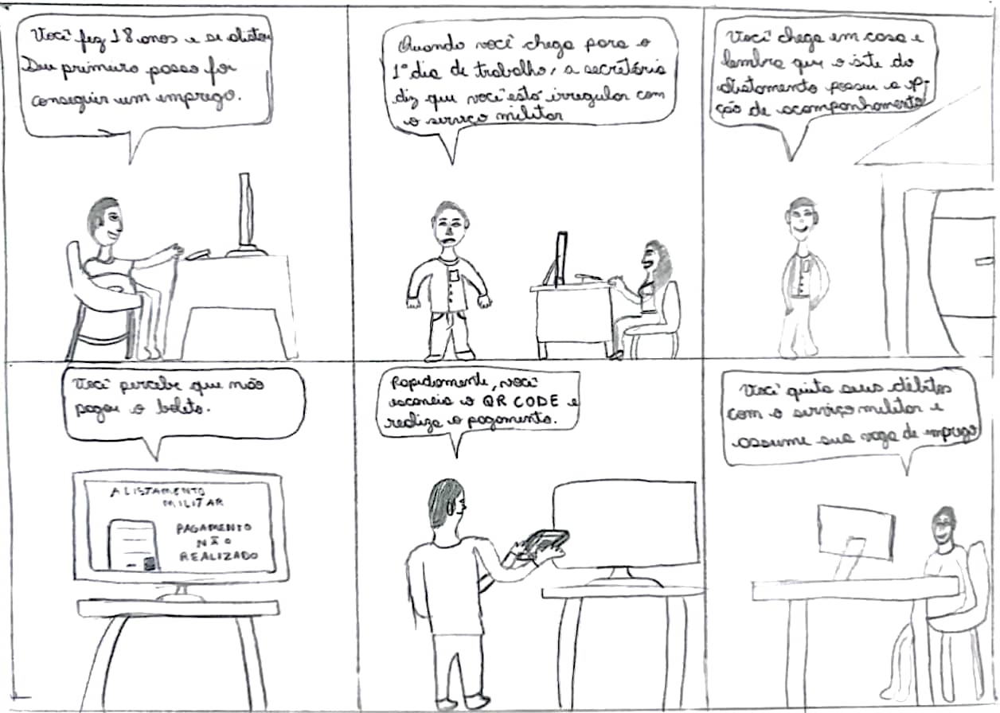

# Introdução

O uso de storyboards é fundamental para auxiliar os desenvolvedores a compreender melhor as expectativas e necessidades dos usuários finais e todas as partes envolvidas no processo do desenvolvimento, através dele que é possível pensar nas diversas versões possíveis para o mesmo projeto.

# Storyboards desenvolvidos

Para essa etapa do projeto, foram criados dois storyboards para representar duas possíveis situações reais na qual a utilização do site do Alistamento Militar fosse útil, cumprindo seu objetivo e facilitando a vida de seus usuários.

Figura 1: Storyboard 1. (Fonte: Autor, 2023).

O Storyboard acima (Figura 1) representa um cenário na qual existe um usuário do sexo masculino que possui 17 anos e acabou de ser aprovado em uma universidade federal (UnB), no entanto, para que o mesmo possa efetuar sua matrícula é necessário que ele possua a reservista militar, documento esse que garante que ele está em dia com seu compromisso militar. No entanto, o garoto não possui tempo para ficar indo e vindo da junta militar várias vezes, então ele utiliza o site do Alistamento Militar Online para dar inicio ao processo e marcar seu exame. Após a realização do exame o garoto utiliza novamente o site para fazer o pagamento e a emissão do seu documento. Com isso ele garante uma maior praticidade no processo e agora está apto para assumir a vaga na universidade pública.

Figura 2: Storyboard 2. (Fonte: Autor, 2023)

O Storyboard acima (Figura 2) representa um cenário na qual o usuário passa em um processo seletivo, mas para assumir a vaga ele necessita da reservista, no entanto, ele não possui tempo nem recursos financeiros para ficar visitando a junta militar varias vezes. Assim, ele utiliza o site do Alistamento Militar Online e simplifica muito o processo, descobrindo que há até a possibilidade de requerer uma segunda via no futuro, assim ele consegue o documento e assume sua vaga desejada.

Figura 3: Storyboard 3. (Fonte: Autor, 2023)

O terceiro storyboard conta a história de um contratante que se agrada do currículo de uma pessoa chamada Felipe. Mas para realizar a contratação, ele primeiro deve se atentar quanto a veracidade do certificado de dispensa militar, para isso, ele utiliza o site do Alistamento online e faz a requisição de validade utilizado o RA, assim, podendo ter a certeza da originalidade do documento.

Figura 4: Storyboard 4. (Fonte: Autor, 2023)

O quarto storboard conta a história de uma pessoa que realizou o seu alistamento e foi chamado para se apresentar em uma junta miilitar. No entanto, o personagem não sabe onde encontrar uma junta, mas lembra que o site do alistamento pode ajudar. Ele pesquisa um lugar mais próximo e se apresenta, quitando seus débitos com o serviço militar.

Figura 5: Storyboard 5. (Fonte: Autor, 2023)

O quinto storyboard conta a história de uma pessoa que acabou de completar 18 anos, se alistou e conseguiu um emprego. No entanto, ao tentar assumir a vaga, a secretária disse que ele estava em débito com o serviço militar e não poderia trabalhar até resolver. O personagem fica triste, mas lembra que no site do alistamento ele consegue acompanhar o processamento. Ao adentrar no site ele percebe que não pagou o boleto. Após realizar o pagamento, ele quita seus débitos e assume a vaga.

## Histórico de versão
| Versão | Data | Descrição | Autor(es) | Revisor(es) |
| --- | --- | --- | --- | --- |
|  `1.0`   | 21/05/2023 | Criação inicial do documento: Storyboard | [Gabriel Souza](https://github.com/GabrielMS00) | [Bruno Martins](https://github.com/gitbmvb) |
| `1.1`   | 22/05/2023  |  Atualização: adição do storyboard 2 | [Gabriel Souza](https://github.com/GabrielMS00) | [Arthur Augusto](https://github.com/arthur-augusto) |
| `1.1`   | 22/05/2023  |  Ajustando bug nas imagens | [Bruno Martins](https://github.com/gitbmvb)| [Gabriel Souza](https://github.com/GabrielMS00) e [Arthur Augusto](https://github.com/arthur-augusto) |
| `1.2`  | 11/06/2023  |  Adição de um novo storyboard (Storyboard 3) | [Gabriel Souza](https://github.com/GabrielMS00) | [João Barreto](https://github.com/JoaoBarreto03)
| `1.3`  | 11/06/2023  |  Adição de dois novos storyboards (Storyboard 4 e 5) | [João Barreto](https://github.com/JoaoBarreto03) | [Gabriel Souza](https://github.com/GabrielMS00) 
| `1.4`  | 11/06/2023  |  Correção de bugs e melhorando a qualidade dos Storyboards 4 e 5 | [João Barreto](https://github.com/JoaoBarreto03) | [Gabriel Souza](https://github.com/GabrielMS00) 
