# Protótipo de Alta Fidelidade

## Introdução

Neste documento apresentamos imagens das telas do nosso protótipo de alta fidelidade. As imagens estão organizadas de acordo com as tarefas que podem ser realizadas pelo usuário.

## Realizar o alistamento militar

As imagens a seguir mostram as telas do protótipo ao realizar o alistamento militar.

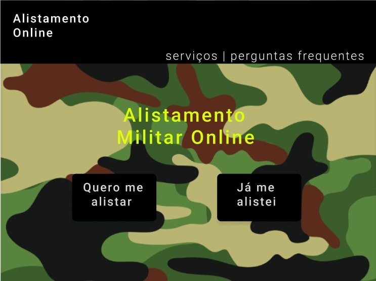

Imagem 1: Realizar o alistamento militar - parte 1 - Tela inicial (Fonte: PAIXÃO, Arthur Augusto; 2023).

Clicando no botão "Quero me alistar"...

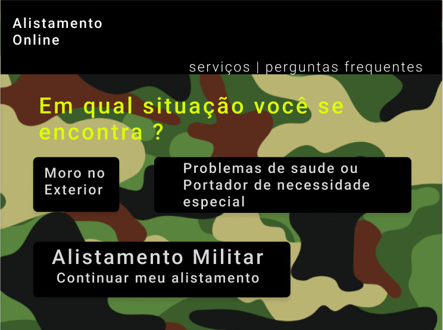

Imagem 2: Realizar o alistamento militar - parte 2 - Situação (Fonte: PAIXÃO, Arthur Augusto; 2023).

Clicando no botão "Continuar meu alistamento"...

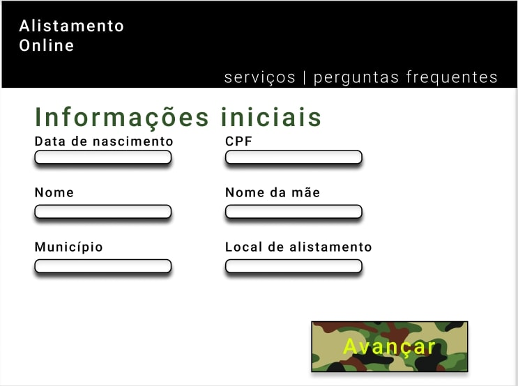

Imagem 3: Realizar o alistamento militar - parte 3 - Informações Iniciais (Fonte: PAIXÃO, Arthur Augusto; 2023).

Após preencher os campos e clicar no botão "Avançar"...

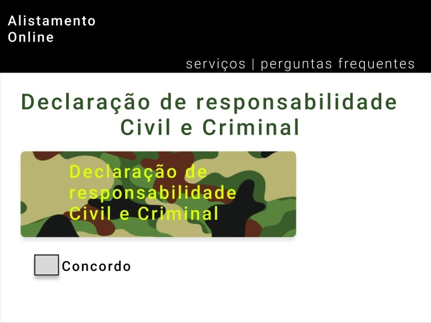

Imagem 4: Realizar o alistamento militar - parte 4 - Declaração (Fonte: PAIXÃO, Arthur Augusto; 2023).

Clicando na caixa de seleção "Concordo"...

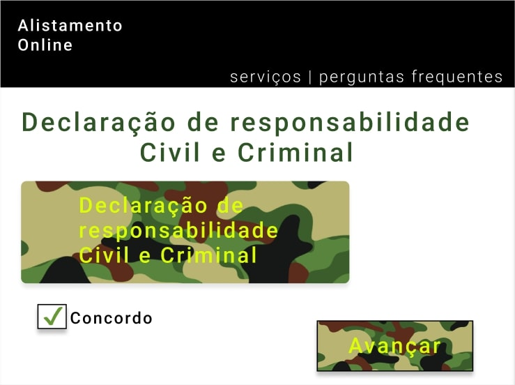

Imagem 5: Realizar o alistamento militar - parte 5 - Declaração Marcado (Fonte: PAIXÃO, Arthur Augusto; 2023).

Clicando no botão "Avançar"...

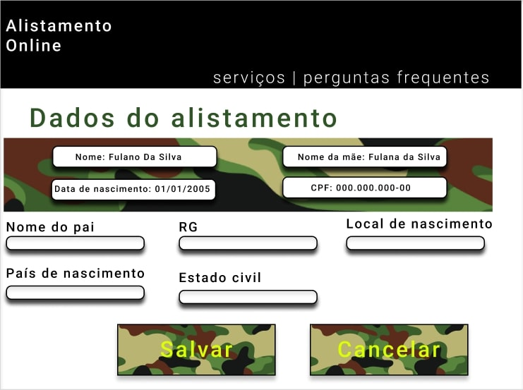

Imagem 6: Realizar o alistamento militar - parte 6 - Declaração Marcado (Fonte: PAIXÃO, Arthur Augusto; 2023).

Clicando no botão "Salvar"...

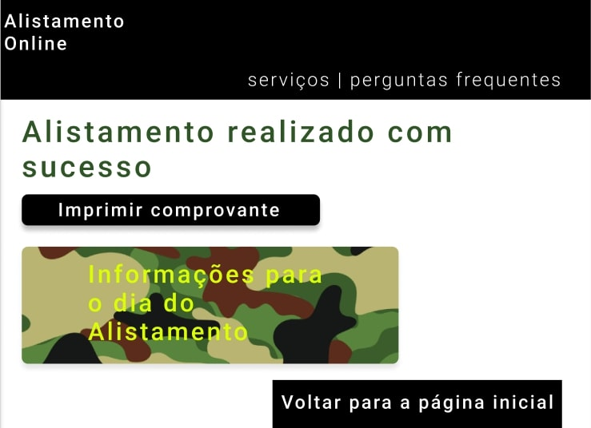

Imagem 7: Realizar o alistamento militar - parte 7 - Alistamento Realizado (Fonte: PAIXÃO, Arthur Augusto; 2023).

## Acompanhar alistamento

As imagens a seguir mostram as telas do protótipo ao acompanhar o alistamento.

Imagem 8: Acompanhar alistamento - parte 1 - Tela inicial (Fonte: PAIXÃO, Arthur Augusto; 2023).

Clicando no botão "Já me alistei"...

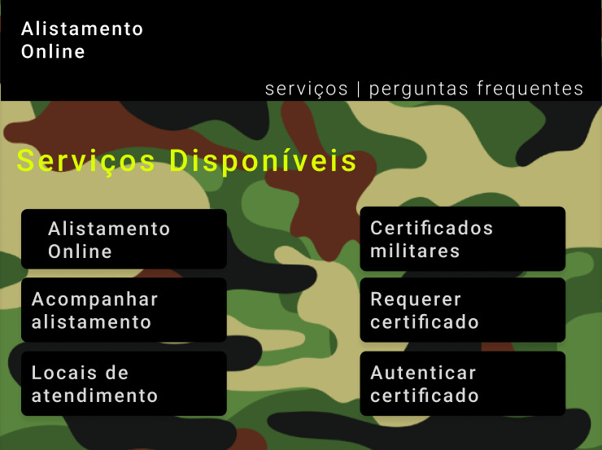

Imagem 9: Acompanhar alistamento - parte 2 - Serviços Disponíveis (Fonte: PAIXÃO, Arthur Augusto; 2023).

Clicando no botão "Acompanhar alistamento"...

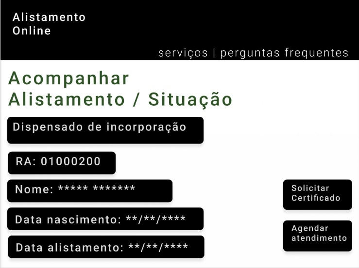

Imagem 10: Acompanhar alistamento - parte 3 - Acompanhar alistamento (Fonte: PAIXÃO, Arthur Augusto; 2023).

## Localizar locais de atendimento

As imagens a seguir mostram as telas do protótipo ao localizar locais de atendimento.

Imagem 11: Localizar locais de atendimento - parte 1 - Tela inicial (Fonte: PAIXÃO, Arthur Augusto; 2023).

Clicando no botão "Já me alistei"...

Imagem 12: Localizar locais de atendimento - parte 2 - Serviços Disponíveis (Fonte: PAIXÃO, Arthur Augusto; 2023).

Clicando no botão "Locais de atendimento"...

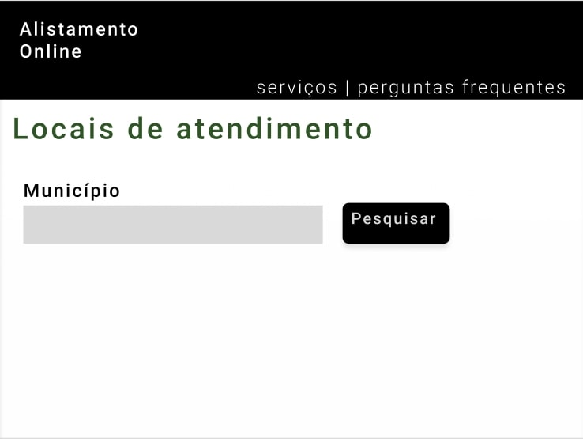

Imagem 13: Localizar locais de atendimento - parte 3 - Busca dos locais de atendimento (Fonte: PAIXÃO, Arthur Augusto; 2023).

Clicando no botão "Pesquisar"...

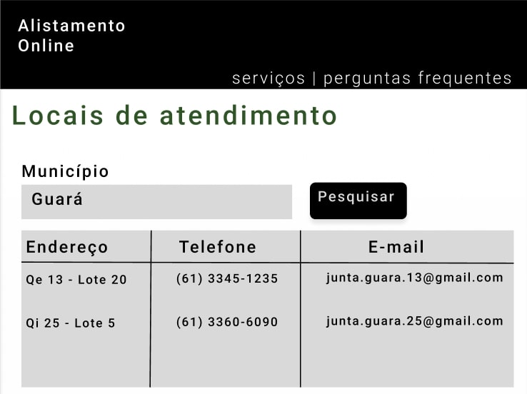

Imagem 14: Localizar locais de atendimento - parte 4 - Resultados locais de atendimento (Fonte: PAIXÃO, Arthur Augusto; 2023).

## Requerer segunda via do certificado de dispensa

As imagens a seguir mostram as telas do protótipo ao requerer segunda via do certificado de dispensa.

Imagem 15: Requerer segunda via do certificado de dispensa - parte 1 - Tela inicial (Fonte: PAIXÃO, Arthur Augusto; 2023).

Clicando no botão "Já me alistei"...

Imagem 16: Requerer segunda via do certificado de dispensa - parte 2 - Serviços Disponíveis (Fonte: PAIXÃO, Arthur Augusto; 2023).

Clicando no botão "Certificados militares"...

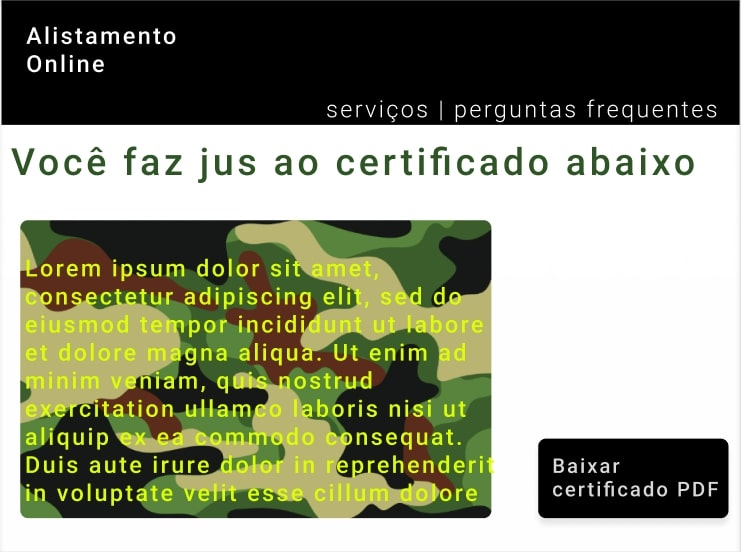

Imagem 17: Requerer segunda via do certificado de dispensa - parte 3 - Requerer certificado (Fonte: PAIXÃO, Arthur Augusto; 2023).

## Bibliografia
BARBOSA, Simone; DINIZ, Bruno. Interação Humano-Computador. Editora Elsevier, Rio de Janeiro, 2010.

## Histórico de versão
| Versão | Data | Descrição | Autor(es) | Revisor(es) |
| --- | --- | --- | --- | --- |
|  `1.0`   | 26/06/2023 | Criação inicial do documento do protótipo de alta fidelidade | [Arthur Augusto](https://github.com/arthur-augusto) | [Bruno Martins](https://github.com/gitbmvb) |