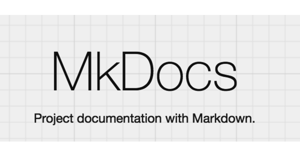

# Entrega final

## 1. Introdução

Durante o primeiro semestre do ano de 2023, o Grupo 5 se responsabilizou com a matéria de Interação Humano Computador ministrada na 
Universidade de Brasília (UnB - FGA), e seu plano de ensino que previa uma avaliação buscando compreender os aspectos envolvidos em uma 
interação humano-computador. Desta forma, nos dedicamos em estudar e documentar tais aspectos envolvidos no site do 
[Alistamento Online](https://alistamento.eb.mil.br/). 
Este artefato possui o objetivo de condensar as informações referentes aos nossos processos e tarefas desenvolvidos ao longo do projeto, 
abrangendo desde a parte de planejamento do projeto até os resultados obtidos.

## 2. Planejamento

Antes da entrega dos primeiros artefatos do projeto, nossa equipe se reuniu de forma virtual mediante o auxílio do 
[Microsoft Teams](./planejamento/ferramentas.md) para decidir quais ferramentas de comunicação e quais horários
seriam escolhidos. Dessa maneira, nas primeiras reuniões foram definidos
a [metodologia](./planejamento/metodologia.md) de execução do trabalho,
o [cronograma](./planejamento/cronograma.md) e as
[ferramentas](./planejamento/ferramentas.md) que seriam
utilizadas. Cada integrante ficou responsável por fazer
a [avaliação heurística](./planejamento/avaliacoes/alistamento.md) de um
site de sua escolha, essa tarefa nos ajudou a termos um embasamento inicial na hora de escolhermos o site que seria avaliado pela equipe. A tabela abaixo mostra os artefatos realizados durante a etapa de planejamento da equipe e elaborados ao longo do semestre:

| Artefato | Autor(es)| Revisor(es)| 
| --- | --- | --- |  
| [Cronograma](./planejamento/cronograma.md) | Bruno Martins | João Barreto
| [Cronograma](./planejamento/cronograma_executado.md) | Bruno Martins | Arthur Augusto, Danilo Carvalho, Gabriel Souza e João Barreto
| [Ferramentas](./planejamento/ferramentas.md) | Bruno Martins | João Barreto
| [Metodologia](./planejamento/metodologia.md) | Arthur Augusto e Bruno Martins | João Barreto  
| [Sites avaliados](./planejamento/sites_avaliados.md) |  João Barreto e Bruno Martins (refatoração) | Danilo Carvalho
| [Avaliação do site: Alistamento Militar Online](./planejamento/avaliacoes/alistamento.md) | Artur de Melo e Bruno Martins | João Barreto  
| [Avaliação do site: Escola de Música em Brasília (EMB)](./planejamento/avaliacoes/escola.md) | Bruno Martins | João Barreto  
| [Avaliação do site: Shopee](./planejamento/avaliacoes/shopee.md) | João Barreto | Bruno Martins
| [Avaliação do site: Striker](./planejamento/avaliacoes/striker.md) | Danilo Carvalho e Bruno Martins | João Barreto
| [Site escolhido](./planejamento/site_escolhido.md) |  João Barreto | Bruno Martins
| [Processo de Design](./planejamento/processo_design.md) | Danilo Carvalho | João Barreto

**Tabela 1:** Artefatos do planejamento com autores e revisores (Fonte: BARRETO, João; 2023).

## 3. Cronograma Planejado x Cronograma Executado

Na etapa de planejamento, foram definidas as datas, os autores e os revisores de cada artefato. Na tabela abaixo serão listadas as atividades realizadas em cada etapa e comparar o que foi executado, com o planejado:

| Atividade | Data planejada | Data da execução | Autor planejado | Autor da execução | Revisor planejado | Revisor da execução|
| --- | --- | --- | --- | --- | --- | --- |
|Escolha do site: motivação e objetivo do site| 13/04 à 20/04 | 13/04 à 14/04| Arthur, Bruno, Danilo, Gabriel, João |Arthur, Bruno, Danilo, Gabriel, João| Arthur, Bruno, Danilo, Gabriel, João| Arthur, Bruno, Danilo, Gabriel, João |
|Listar ferramentas utilizadas: apresentação das ferramentas e utilização de cada uma delas| 13/04 à 22/04 | 22/04 à 23/04| Bruno Martins e Gabriel Souza | Bruno Martins| Arthur Augusto | João Barreto |
|Criação da estrutura da GitHub Page: Template de abas e tema| 13/04 à 22/04 | 22/04 à 23/04| Danilo Carvalho e João Barreto | Bruno Martins e João Barreto | Arthur, Bruno, Danilo, Gabriel, João | João Barreto |
|Criação do Cronograma completo: datas, autores, revisores e divisão de tarefas| 13/04 à 21/04 | 22/04 à 23/04| Arthur de Melo | Arthur de Melo| Danilo Carvalho | Bruno Martins |
|Processos de Design: Conceito e ciclo de vida escolhido| 13/04 à 23/04 | 23/04 à 24/04| Danilo e Arthur Augusto | Danilo e Arthur Augusto| João Barreto | Bruno Martins e João Barreto |
| Implementar Cronograma na GitPage | 13/04 à 22/04 | 22/04 | Bruno Martins | Bruno Martins | João Barreto | João Barreto |
| Realização do Planejamento: avaliação dos sites, contendo introdução e metodologia utilizada| 13/04 à 23/04 | 23/04 | Arthur, Bruno, Danilo, Gabriel, João | Bruno Martins e João Barreto| Bruno Martins João Barreto | Bruno Martins e João Barreto |
| Apresentação: gravação, upload do vídeo, envio do link do vídeo no Aprender3 | 23/04 à 24/04 | 24/04 | João Barreto | Danilo Carvalho | Danilo Carvalho | Gabriel Souza |
| Aspectos éticos de pesquisa: Introdução e apresentação dos princípios éticos| 26/04 à 04/05 | 04/05| João Barreto e Gabriel Souza|   João Barreto e Gabriel Souza | Arthur Augusto | Arthur Augusto
| Perfil do Usuário: Elaboração do questionário, coleta e análise dos dados | 26/04 à 05/05 | 04/05 à 05/05 | Arthur Augusto e Danilo Carvalho|Arthur Augusto e Danilo Carvalho| Gabriel | Gabriel |
| Personas: Motivação e criação das personas a partir do perfil do usuário | 26/04 à 06/05 | 06/05 | Gabriel Souza| Gabriel Souza|Bruno Martins | Bruno Martins
| Análise de tarefas do usuário: Realizar os caminhos que o usuário faria no site | 26/04 à 07/05 | 07/05| Bruno Martins e Danilo Carvalho| Bruno Martins e Danilo Carvalho | João Barreto | João Barreto
| Apresentação: gravação, upload do vídeo, envio do link do vídeo no Aprender3 | 07/05 | 07/05| João Barreto | João Barreto | Danilo Carvalho | Danilo Carvalho
| Princípios gerais de projeto: listagem dos princípios e descrição de cada um | 10/05 à 12/05 | 11/05 à 13/05 | João Barreto e Danilo Carvalho | Danilo Carvalho| Bruno Martins | Bruno Martins
| Metas de usabilidade: definição de metas e identificação de requisitos levantados a partir delas | 10/05 à 13/05 | 14/05 | Arthur Augusto e Gabriel Souza | Arthur Augusto e Gabriel Souza | João Barreto | João Barreto
| Guia de estilo: definição do objetivo, apresentação do conteúdo do guia | 10/05 à 14/05 | 15/05 | Bruno Martins | Bruno Martins | Arthur Augusto | Arthur Augusto e Gabriel Souza
| Características da plataforma: listagem e explicação de cada característica | 10/05 à 14/05 | 13/05 à 14/05 | João Barreto| João Barreto| Gabriel Souza | Gabriel Souza
| Apresentação: gravação, upload do vídeo, envio do link do vídeo no Aprender3 | 14/05 à 15/05 | 15/05| Arthur Augusto, Bruno, Danilo, Gabriel, João | Arthur Augusto, Bruno, Danilo, Gabriel, João | Arthur Augusto, Bruno, Danilo, Gabriel, João | Arthur Augusto, Bruno, Danilo, Gabriel, João
| Planejamento da avaliação do storyboard: Metodologia utilizada, papel dos avaliadores, criação das perguntas e desenvolvimento dos storyboards | 17/05 à 20/05 | 21/05| Bruno Martins e Gabriel Souza| Bruno Martins e Gabriel Souza|  Bruno Martins e Gabriel Souza|Bruno Martins e Gabriel Souza |
| Desenvolvimento dos storyboards | 21/05 | 21/05 | Gabriel Souza| Gabriel Souza| Bruno Martins| Bruno Martins
| Planejamento do relato dos resultados: listagem de elementos do relato, metodologia, problemas e sugestões | 17/05 à 20/05 | 19/05 à 20/05| Danilo Carvalho e João Barreto | Danilo Carvalho e João Barreto | Arthur Augusto | Arthur Augusto
| Planejamento da avaliação de análise de tarefas: Definir a metodologia a ser utilizada para executar o planejamento da análise de tarefas e do teste piloto | 17/05 à 21/05 | 19/05 à 20/05 | João Barreto | João Barreto | Danilo Carvalho | Danilo Carvalho
| Planejamento do relato dos resultados da avaliação da análise de tarefas: apresentação da metodologia, definição do objetivo, análise dos dados e sugestões| 17/05 à 20/05 | 20/05| Danilo Carvalho e Arthur Augusto | Danilo Carvalho e Arthur Augusto | João Barreto | João Barreto
| Apresentação: gravação, upload do vídeo, envio do link do vídeo no Aprender3 | 21/05 à 22/05| 22/05| Bruno Martins | Bruno Martins | Gabriel Souza| Gabriel Souza
| Relato dos resultados do storyboard: apresentação da metodologia, objetivos da avaliação dos storyboards e gravação do teste piloto | 24/05 à 28/05 | 27/05 à 28/05 |  Arthur Augusto e Gabriel Souza | Arthur Augusto e Gabriel Souza | Bruno Martins | Bruno Martins
| Relato dos resultados da análise de tarefas:  apresentação da metodologia e dos dados coletados. Gravação da entrevista| 24/05 à 29/05 | 29/05 |João Barreto e Danilo Carvalho |João Barreto e Danilo Carvalho | Arthur Augusto | Arthur Augusto
| Planejamento da avaliação na prototipação de papel: descrição dos objetivos, metodologias e ferramentas. Listagem dos elementos do protótipo, termo de consentimento e entrevista | 24/05 à 29/05 | 28/05 à 29/05 |Bruno Martins e Gabriel Souza | Danilo Carvalho | Danilo Carvalho|
| Planejamento do relato de resultados da avaliação na prototipação de papel: Descrição dos elementos do relato, objetivo, metodologia, sugestões | 24/05 à 28/05 | 28/05 | Bruno Martins e Arthur Augusto | Bruno Martins | João Barreto | Danilo Carvalho
| Apresentação: gravação, upload do vídeo, envio do link do vídeo no Aprender3 | 29/05 |29/05 | Bruno Martins | Danilo Carvalho| Gabriel Souza | Gabriel Souza
| Planejamento e execução da avaliação dos artefatos da Etapa 01 do grupo 06: Home page, cronograma, cronograma executado, metolodia, ferramentas e processo de Design. | 31/06 à 05/06 | 05/06 | Bruno Martins | Bruno Martins | João Barreto | João Barreto
| Planejamento e execução da avaliação dos artefatos da Etapa 02 do grupo 06: Perfil do usuário, aspectos éticos de pesquisas envolvendo pessoas, personas e análise de tarefas. | 31/05 à 04/06 | 03/06 à 04/06 | Gabriel Marques | Gabriel Marques | Arthur Augusto | João Barreto
| Planejamento e execução da avaliação dos artefatos da Etapa 03 do grupo 06: Princípios gerais de projeto, metas de usabilidade, guia de estilo. | 31/05 à 05/06 | 05/06 |João Barreto |João Barreto | Bruno Martins |Bruno Martins 
| Planejamento e execução da avaliação dos artefatos da Etapa 04 do grupo 06: Planejamento da avaliação do storyboard e análise de tarefas, planejamento do relato dos resultados da avaliação do storyboard e o planejamento do relato dos resultados da avaliação do análise de tarefas. | 31/05 à 05/06 | 05/06 | Arthur Augusto | Arthur Augusto |Gabriel Marques |Gabriel Marques e João Barreto|
| Planejamento e execução da avaliação dos artefatos da Etapa 05 do grupo 06: Relato dos resultados do storyboard e da análise de tarefas, planejamento da avaliação do protótipo de papel e do planejamento do relato dos resultados da avaliação do protótipo de papel.| 31/05 à 04/06 | 04/06 |Danilo Carvalho |Danilo Carvalho | Bruno Martins | João Barreto
| Apresentação: gravação, upload do vídeo, envio do link do vídeo no Aprender3 | 04/06 à 05/06 | 05/06 |Bruno Martins | Bruno Martins| Gabriel Souza | Gabriel Souza
| Planejamento e execução da avaliação dos artefatos da Etapa 01: Home page, cronograma, cronograma executado, metolodia, ferramentas e processo de Design. | 14/06 à 19/06 | 19/06 |Bruno Martins |Bruno Martins | João Barreto |Arthur Augusto |
| Planejamento e execução da avaliação dos artefatos da Etapa 02: Perfil do usuário, aspectos éticos de pesquisas envolvendo pessoas, personas e análise de tarefas. | 14/06 à 19/06 |  18/06 à 19/06 | Gabriel Marques |Gabriel Marques | Arthur Augusto | João Barreto
| Planejamento e execução da avaliação dos artefatos da Etapa 03: Princípios gerais de projeto, metas de usabilidade, guia de estilo. | 14/06 à 19/06 |  18/06 |João Barreto |João Barreto | Bruno Martins | Bruno Martins
| Planejamento e execução da avaliação dos artefatos da Etapa 04: Planejamento da avaliação do storyboard e análise de tarefas, planejamento do relato dos resultados da avaliação do storyboard e o planejamento do relato dos resultados da avaliação do análise de tarefas. | 14/06 à 19/06 | 19/06 | Arthur Augusto |  Arthur Augusto |  Gabriel Marques | Gabriel Marques 
| Planejamento e execução da avaliação dos artefatos da Etapa 05: Relato dos resultados do storyboard e da análise de tarefas, planejamento da avaliação do protótipo de papel e do planejamento do relato dos resultados da avaliação do protótipo de papel.| 14/06 à 19/06 | 19/06 | Danilo Carvalho | Danilo Carvalho |Bruno Martins | João Barreto
| Apresentação: gravação, upload do vídeo, envio do link do vídeo no Aprender3 | 19/06 | 19/06 | Bruno Martins | Bruno Martins |Gabriel Souza |Gabriel Souza
| Relato dos resultados da prototipação de papel: descrição do objetivo, metodologias e participante, incluindo avaliadores. Explicação do protótipo de papel com imagens | 07/06 à 12/06 | 12/06 | João Barreto e Gabriel Souza |  João Barreto e Gabriel Souza| Bruno Martins |Bruno Martins
| Planejamento da avaliação do protótipo de alta fidelidade: descrição dos objetivos, metodologia, criação do cronograma de avaliação, recrutamento de participantes, planejamento do teste piloto e papel dos avaliadores | 07/06 à 12/06 | 12/06 |  Arthur Augusto e Bruno Martins | Bruno Martins |Gabriel Souza | Gabriel Souza
| Planejamento do relato dos resultados da avaliação do protótipo de alta fidelidade: Apresentação do teste piloto, definição de metodologia, participantes e avaliadores. Apresentação do protótipo de alta fidelidade | 09/06 à 12/06  | 12/06 | | Danilo Carvalho| João Barreto| Arthur Augusto | Bruno Martins
| Apresentação: gravação, upload do vídeo, envio do link do vídeo no Aprender3 | 12/06 | 12/06 | Bruno Martins| Bruno Martins| Gabriel Souza|Gabriel Souza
| Elaboração do protótipo de alta fidelidade | 21/06 à 26/06 | 26/06 |  Arthur Augusto, Danilo Carvalho, Gabriel Marques|Arthur Augusto, Danilo Carvalho, Gabriel Marques| João Barreto | João Barreto
| Realização do teste piloto da avaliação do protótipo de alta fidelidade | 21/06 à 26/06 | 26/06 | Danilo Carvalho | Danilo Carvalho | Gabriel Souza |Gabriel Souza 
| Registro dos resultados na gitpages | 21/06 à 26/06 | 26/06 |  Gabriel Marques | Gabriel Marques |Danilo Carvalho |Danilo Carvalho
| Refatoração parcial dos artefatos das etapas 1 e 2 | 21/06 à 26/06 | 26/06 | Bruno Martins e João Barreto | Bruno Martins e João Barreto | Bruno Martins e João Barreto | Bruno Martins e João Barreto 
| Apresentação: gravação, upload do vídeo, envio do link do vídeo no Aprender3 | 26/06 |  26/06 |Arthur Augusto, Danilo Carvalho, Gabriel Marques, João Barreto |Arthur Augusto, Danilo Carvalho, Gabriel Marques, João Barreto | Bruno Martins | Bruno Martins

**Tabela 2**: Cronograma planejado x Cronograma executado (**Fonte:** BARRETO, João; 2023).

## 4. Ferramentas

As ferramentas utilizadas durante a execução do projeto estão listadas na tabela abaixo:

Logo | Ferramenta | Descrição | Finalidade no projeto |
|---|---|---|---|
|  | Figma [1] | Figma é uma ferramenta de design colaborativa baseada na nuvem. Ela permite que designers e equipes trabalhem juntos em projetos de design de forma eficiente e eficaz. Com o Figma, é possível criar interfaces de usuário, protótipos interativos e colaborar em tempo real. | Trabalhar com protótipos de alta fidelidade na etapa final do projeto (nível 3 de desenvolvimento).
|  | Firefox [2] | O Firefox é um navegador de internet gratuito e de código aberto desenvolvido pela Mozilla. Ele oferece uma experiência de navegação rápida, segura e personalizável. | Acessar os sites e utilizar as diversas ferramentas disponíveis na web.
| | Github [3] | O GitHub é uma plataforma de desenvolvimento colaborativo baseada em nuvem que permite que os desenvolvedores armazenem, gerenciem e colaborem em projetos de software. Ele usa o sistema de controle de versão Git, que permite rastrear alterações em arquivos ao longo do tempo.  | Armazenar os artefatos produzidos no repositório da disciplina, criar issues, commits, registrar as atividades e gerenciar o projeto.
|  | Google Chrome [4] | O Google Chrome é um navegador de internet rápido, seguro e fácil de usar desenvolvido pelo Google. Ele oferece uma experiência de navegação eficiente, permitindo que os usuários acessem rapidamente sites, pesquisem informações e executem aplicativos da web.  | Acessar os sites e utilizar as diversas ferramentas disponíveis da web.
|  | Google Docs [5] | O Google Docs é uma ferramenta de processamento de texto baseada na nuvem desenvolvida pelo Google. Ele permite que os usuários criem, editem e compartilhem documentos de texto de forma colaborativa e em tempo real. Com o Google Docs, é possível criar documentos como relatórios, artigos, currículos, etc. | Redigir as entregas das atividades individuais e em grupo, bem como para registrar o link do repositório e do vídeo de apresentação para cada entrega (este é um arquivo que deverá ser postado no aprender a cada entrega, em pdf).
|  | Google Forms [6] | O Google Forms é uma ferramenta de criação de formulários online gratuita fornecida pelo Google. Ela permite que os usuários criem questionários, pesquisas e enquetes de maneira rápida e fácil.  | Criar os questionários para coleta de dados, para assim nos auxiliar a definir as personas e o perfil de usuário da plataforma.
|  | Microsoft Excel [7] | O Microsoft Excel é um programa de planilha eletrônica desenvolvido pela Microsoft. Ele oferece uma ampla gama de recursos para criar, organizar e analisar dados de maneira eficiente. | Criar a planilha do cronograma inicial.
|  | Microsoft Teams [8] | O Microsoft Teams é uma plataforma de comunicação e colaboração baseada na nuvem desenvolvida pela Microsoft. Ela permite que equipes e grupos de trabalho se comuniquem, compartilhem arquivos e colaborem em projetos de forma eficiente.  | Realizar as reuniões semanais, gravar os vídeos das apresentações e entrevistas com os usuários durante a etapa de avaliação de storyboards, protótipos de papel, etc.
|  | Miro [9] | Miro é uma plataforma de colaboração online que permite que equipes trabalhem de forma criativa e colaborativa, independentemente da localização geográfica. Ele é projetado para facilitar a colaboração visual, permitindo que os usuários criem e compartilhem quadros virtuais onde podem colaborar em tempo real. | Auxiliar na classificação do perfil de usuário.
|  | Mkdocs [10] | Mkdocs é um framework open-source que converte arquivos em markdown para html, criando páginas web simples e dinâmicas - geralmente destinadas à documentação. | Criar uma página web do zero seria muito trabalhoso. Por isso, o Mkdocs será empregado para criar páginas em markdown, as quais serão convertidas em html automaticamente no deployment.
|  | Telegram [11] | O Telegram é um aplicativo de mensagens instantâneas que permite aos usuários se comunicarem de forma rápida e segura. Ele oferece recursos de troca de mensagens individuais e em grupo, permitindo enviar textos, fotos, vídeos, arquivos e mensagens de voz. | Estabelecer uma comunicação rápida com o professor e os demais colegas da turma, para nos manter constatemente atualizados sobre as atividades e avisos da disciplina.
|  | This Person Doesn't Exist [12] | Este é um framework que produz imagens de pessoas fictícias (personas) | As imagens serão empregadas durante a parte de construção das personas, anti-personas, e perfil dos usuários da plataforma. |
|  | VSCode [13] | O VSCode (Visual Studio Code) é um editor de código-fonte desenvolvido pela Microsoft, suporta uma ampla gama de linguagens de programação e oferece recursos avançados, como realce de sintaxe, autocompletar, depuração de código, controle de versão integrado e suporte a extensões. | Construção, desenvolvimento e aprimoramento da gitpages durante todo o projeto, auxiliando-se no framework Mkdocs para redigir arquivos em markdown.
|  | Whatsapp [14] | O WhatsApp é um aplicativo de mensagens instantâneas popular para smartphones e outros dispositivos móveis. Ele permite que os usuários enviem mensagens de texto, façam chamadas de voz e vídeo, compartilhem fotos, vídeos, documentos e localização em tempo real. | Estabelecer uma comunicação rápida e informal entre os integrantes do grupo, no intuito de discutir ideias, compartilhar arquivos e documentos úteis, combinar horários, etc.
|  | Youtube [15] | O YouTube é uma plataforma de compartilhamento de vídeos online. Ele permite que os usuários carreguem, assistam e compartilhem uma ampla variedade de vídeos em diversos temas e gêneros. | Fazer o upload dos vídeos das apresentações e também das gravações com os participantes das entrevistas (e. g. avaliação dos storyboards, avaliação do protótipo de papel, etc.)

**Tabela 3:** Ferramentas utilizadas no projeto (Fonte: MARTINS, Bruno; 2023).

## 5. Ciclo de vida

### 5.1. Análise de Requisitos

Na análise de requisitos são definidas as metas de usabilidade, a análise de tarefas, o guia de estilo, os princípios gerais do projeto e outros artefatos que serão apresentados na tabela abaixo:

| Artefato | Autor (es) | Revisor (es) |
| --- | --- | ---
| [Análise de Tarefas](./analise_requisitos/analise_tarefas.md)| |
| [Aspectos Éticos](./analise_requisitos/aspectos_eticos.md)| |
| [Características da Plataforma](./analise_requisitos/caracteristicas.md)| |
| [Cenários](./analise_requisitos/cenarios.md)| |
| [Guia de Estilo](./analise_requisitos/guia_estilo.md)| |
| [Metas de Usabilidade](./analise_requisitos/metas_usabilidade.md)| |
| [Perfil dos Usuários](./analise_requisitos/perfil_do_usuario.md)| |  
| [Personas](./analise_requisitos/personas.md)| |
| [Princípios Gerais do Projeto](./analise_requisitos/principios_gerais.md)| |

