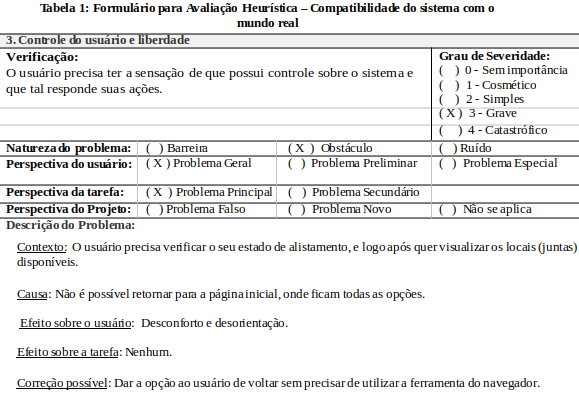
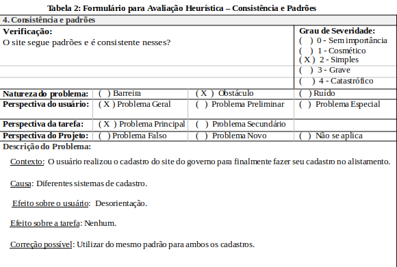
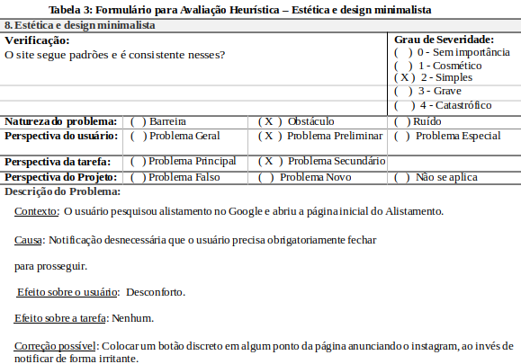

**Arthur de Melo Viana, 211029147**

Disciplina de Interação Humano-Computador, 2023.1

Prof. André Barros de Sales

---
# Planejamento da Avaliação de IHC – Alistamento Militar Online

Essa avaliação de IHC tem como objetivo verificar se o _site_ do Exército Brasileiro para a realização do Alistamento Militar Online conseguiu atender às mais diversas camadas sociais. Dado que todos os jovens que completam 18 anos em um determinado ano devem realizar sua inscrição nos primeiros seis meses daquele ano.

Portanto, há de se avaliar três principais caminhos de interação e suas respectivas interfaces:

- Realizar alistamento.
- Acompanhar alistamento.
- Requerer certificado de dispensa.

Para isso, será utilizado o método de inspeção de avaliação heurística, o qual permite o inspecionamento ao examinador, que deve ser capaz de identificar possíveis situações que ocorreriam nas experiências de uso dos mais diversos usuários. Sendo assim, a escolha desse método se dá pelo não envolvimento de usuários, o que facilita a avaliação. Além disso, é um método simples, rápido e de baixo custo.

O único participante desta avaliação será o avaliador. No entanto, tal avaliador precisa ter em mente os mais variados perfis que utilizam o _site_ para realizar e acompanhar o alistamento militar. Para isso, separar-se-á os perfis em três categorias no que tange à familiaridade com o uso da Internet:

- Familiarizados.
- Parcialmente familiarizados.
- Nenhuma experiência.

Portanto, o avaliador precisa focar principalmente na avaliação para aqueles que possuem nenhuma experiência com o ambiente online, pois esses talvez não tenham uma ideia intuitiva já construída por experiências anteriores. Logo, o ambiente analisado deve condizer com experiências análogas na realidade.

Os equipamentos utilizados para a avaliação serão: um computador com acesso à Internet, um monitor, um teclado e um mouse. Todo o ambiente já está configurado. A escolha do computador ocorreu por causa do tamanho maior da tela, que pode entrar em conflito com alguma escolha de fonte ou de cor, o que causaria uma dificuldade para a leitura.

O teste piloto foi realizado rapidamente, a conexão com a internet é estável e tudo funciona normalmente. No entanto, para a verificação de como seria a realização do alistamento, não foi permitido ao avaliador inspecionar, pois tal já havia realizado seu alistamento. Sendo assim, a análise será feita por meio de vídeos daquela parte. Para os outros caminhos, foi possível acessar normalmente.

**Avaliação de IHC – Alistamento Militar Online**

Essa avaliação de IHC tem como objetivo verificar se o _site_ do Exército Brasileiro para a realização do Alistamento Militar Online conseguiu atender às mais diversas camadas sociais. Dado que todos os jovens que completam 18 anos em um determinado ano devem realizar sua inscrição nos primeiros seis meses daquele ano. Para tal avaliação, utilizar-se-á o método de inspeção da Avaliação Heurística, a qual será feita conforme os critérios de Nielsen.

### 1. Status do sistema

Para tal critério, avaliar-se-á se o site em questão deve informar o usuário sobre a ação que está sendo executada e o estado de tal. Portanto, o primeiro aspecto a ser avaliado será o cadastro, que é realizado por meio do site Portal Gov, para o cadastro nesse site, utiliza-se a inserção de dados um de cada vez, com um feedback explicativo sobre cada ação que será realizada.

Após essa etapa, a parte de alistamento também permite verificar cada informação colocada antes de avançar para a próxima página. Sendo assim, o usuário tem ciência de que errou uma informação específica antes de ter que avançar e preencher tudo novamente. No entanto, alguns avisos são muito discretos, como, por exemplo, em "Acompanhar alistamento", aparece em cima, em letras pequenas e em uma caixa azul, que pouco chama a atenção.

### 2. Compatibilidade do sistema com o mundo real

O sistema deve organizar as informações em conformidade com a realidade, ou seja, a ordem das ações deve seguir um padrão lógico que seja visto de forma natural pelo usuário. Para isso, o sistema utiliza-se de um padrão onde os itens para quem ainda está no processo de alistamento à esquerda, e para quem já o finalizou à direita.

Já para a ordem, o primeiro item de cada coluna é sempre o primeiro que deve ser feito, e o mesmo padrão segue para o segundo e o terceiro item. No entanto, não há uma separação clara, tudo fica em um mesmo bloco de "Serviços Disponíveis". Além disso, todos os botões são da mesma cor e tamanho.

### 3. Controle do usuário e liberdade

O usuário não possui liberdade dentro das ações, uma vez que clicou em uma seção, para retornar à página anterior, só utilizando da própria ferramenta do navegador para retornar. Não possui botão de voltar em nenhuma das seções, qualquer caminho que o usuário tomar, é sem volta.

### 4. Consistência e padrões

Os elementos são compatíveis com os navegadores. No entanto, o sítio peca na consistência, por exemplo, existem dois momentos nos quais o usuário deve fazer um cadastro: no sítio do Gov e no próprio alistamento, e ambos seguem padrões completamente diferentes.

### 5. Prevenção de erros

Como o título já explica, o sítio deve ser organizado de forma que evite o usuário de cometer erros. Grande parte das informações são verificadas na mesma hora, mas, por exemplo, a data de nascimento, o próprio usuário deve apertar para verificar, não é algo que faz automaticamente. O que deveria acontecer para todos os blocos. E, em alguns casos, a informação não é verificada, o que faz o usuário ter que repetir o processo.

### 6. Reconhecimento ao invés de lembrança

Nesse critério, o sistema precisa perdurar informações já fornecidas e verificadas para o preenchimento automático dessas, o que evita erros e também faz com que o usuário não tenha que preencher a mesma informação múltiplas vezes. Dado que algumas são trabalhosas de digitar e de verificar.

No caso, o usuário já tem um cadastro no site do governo, o qual possui inúmeras informações do usuário. No entanto, na parte de alistamento, o usuário precisa digitar todas as informações que ele já forneceu, inclusive no próprio login, ao invés dessas informações já estarem preenchidas e o usuário tenha que somente verificá-las.

### 7. Flexibilidade e eficiência de uso

Dado que o alistamento deve ser feito nos primeiros 6 meses de um determinado ano por todos os jovens que completariam 18 anos, o sistema deve ser flexível e deve atender aos mais variados perfis de usuários.

O site não é personalizável, é o mesmo para todos. No entanto, o cadastro realizado no Gov é bem intuitivo e explicativo, com ícones grandes e avisos sobre a sua atual situação no processo. No entanto, tais características não são replicadas no Alistamento, letras pequenas, sem opção de zoom, algumas informações são posicionadas de maneira discreta e todos os botões são apresentados como se fossem de mesma importância.

### 8. Estética e design minimalista

Neste tópico, os elementos visuais não devem causar confusão ou distração, as informações relevantes devem sempre prevalecer. Algo que é possível analisar logo na página inicial, aparece um aviso que cobre grande parte da tela, anunciando o instagram do alistamento oficial, o que se trata de uma informação distrativa e completamente irrelevante.

### 9. Ajudar os usuários a reconhecer, diagnosticar e corrigir erros

Para todo erro que o usuário cometer, o sistema deve dar um feedback com mensagens que explicitam o erro cometido e, se necessário, ensinando-o a corrigir tal. No primeiro cadastro, os erros são explicitados em cor vermelha, de forma que o usuário consiga detectar. Já no alistamento, em algumas seções, os avisos são discretos e, alguns, em cor azul, o que pode passar despercebido pelo usuário.

### 10. Ajuda e documentação

Nesse tópico, analisa-se os recursos de ajuda ao usuário. Para tal, verificou-se que o sistema não apresenta um serviço de atendimento online para ajudar o usuário, mas disponibiliza uma página de Perguntas Frequentes, com diversas respostas às mais variadas perguntas. Tal seção é dividida em três tópicos, cada um deles com várias perguntas e suas respectivas respostas para os mais diferentes casos. As perguntas são diretas e simples de entender e as respostas são diretas, sem termos complicados e com poucas palavras.

## Histórico de versão
| Versão | Data | Descrição | Autor(es) | Revisor(es) |
| --- | --- | --- | --- | --- |
|  `1.0`   | 18/04/2023 | Criação inicial do documento | [Arthur de Melo](https://github.com/arthurmlv) | N/A |
|  `1.1`   | 23/04/2023 | Upload do documento para a gitpages | [Bruno Martins](https://github.com/gitbmvb) | [João Barreto](https://github.com/JoaoBarreto03) |
