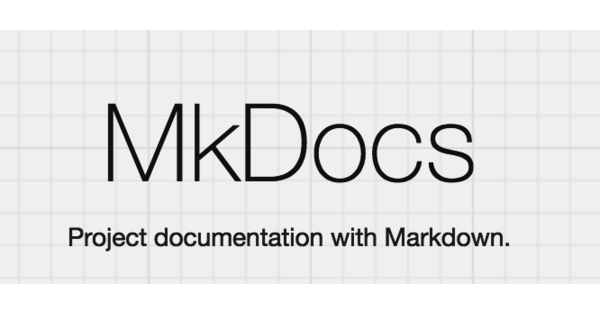

# Ferramentas
As ferramentas foram selecionadas de modo a facilitar a comunicação entre os membros da equipe e alavancar, na medida do possível, a produtividade e criatividade. Nesse sentido, as ferramentas são as seguintes, listadas na Tabela 1:

Logo | Ferramenta | Finalidade |
|---|---|---|
|  | Figma [1] | Trabalhar com protótipos de alta fidelidade
|  | Firefox [2] | Acessar os sites e utilizar as diversas ferramentas
| | Github [3] | Armazenar os conteúdos no repositório da disciplina
|  | Google Chrome [4] | Acessar os sites e utilizar as diversas ferramentas
|  | Google Docs [5] | Redigir textos e documentos antes de serem postados na gitpages
|  | Google Forms [6] | Enviar o formulário e criar o perfil de usuário
|  | Microsoft Excel [7] | Criar as planilhas do cronograma
|  | Microsoft Teams [8] | Realizar as reuniões semanais e gravar os vídeos das apresentações
|  | Miro [9] | Classificação do perfil de usuário
|  | Mkdocs [10] | Criação do template da github pages
|  | Telegram [11] | Manter a comunicação rápida com o professor e o restante da turma
|  | This Person Doesn't Exist [12] | Geração de imagens para as personas  
|  | VSCode [13] | Programação e edição da github pages
|  | Whatsapp [14] | Manter a comunicação entre os integrantes
|  | Youtube [15] | Compartilhar apresentações e disponibilizar as reuniões semanais

Tabela 1: Ferramentas utilizadas no projeto (Fonte: autor, 2023). 

## Bibliografia
[1] **Figma**. Disponível em: [https://www.figma.com/](https://www.figma.com/). Acesso em: 06 maio 2023.

[2] **Firefox**. Disponível em: [https://www.mozilla.org/pt-BR/firefox/](https://www.mozilla.org/pt-BR/firefox/). Acesso em: 06 maio 2023.

[3] **GitHub**. Disponível em: [https://www.github.com](https://www.github.com). Acesso em: 06 maio 2023.

[4] **Google Chrome**. Disponível em: [https://www.google.com/chrome/](https://www.google.com/chrome/). Acesso em: 06 maio 2023.

[5] **Google Docs**. Disponível em: [https://docs.google.com/document/u/0/](https://docs.google.com/document/u/0/). Acesso em: 06 maio 2023.

[6] **Google Forms**. Disponível em: [https://workspace.google.com/intl/pt-BR/lp/forms/](https://workspace.google.com/intl/pt-BR/lp/forms/). Acesso em: 06 maio 2023.

[7] **Microsoft Excel**. Disponível em: [https://www.microsoft.com/pt-br/microsoft-365/excel](https://www.microsoft.com/pt-br/microsoft-365/excel). Acesso em: 06 maio 2023.

[8] **Microsoft Teams**. Disponível em: [https://teams.microsoft.com/](https://teams.microsoft.com/). Acesso em: 06 maio 2023.

[9] **Miro**. Disponível em: [https://miro.com/](https://miro.com/). Acesso em: 06 maio 2023.

[10] **MkDocs**. Disponível em: [https://www.mkdocs.org/](https://www.mkdocs.org/). Acesso em: 06 maio 2023.

[11] **Telegram**. Disponível em: [https://telegram.org/](https://telegram.org/). Acesso em: 06 maio 2023.

[12] **This person doesn't exist**. Disponível em: [https://this-person-does-not-exist.com/](https://this-person-does-not-exist.com/). Acesso em: 06 maio 2023.

[13] **Visual Studio Code (VS Code)**. Disponível em: [https://code.visualstudio.com/](https://code.visualstudio.com/). Acesso em: 06 maio 2023.

[14] **WhatsApp**. Disponível em: [https://www.whatsapp.com/?lang=pt_br](https://www.whatsapp.com/?lang=pt_br). Acesso em: 06 maio 2023.

[15] **YouTube**. Disponível em: [https://www.youtube.com/](https://www.youtube.com/). Acesso em: 06 maio 2023.

## Histórico de versão
| Versão | Data | Descrição | Autor(es) | Revisor(es) |
| --- | --- | --- | --- | --- |
|  `1.0`   | 23/04/2023 | Criação da página de ferramentas | [Bruno Martins](https://github.com/gitbmvb) | [João Barreto](https://github.com/JoaoBarreto03) |
|  `1.1`   | 06/05/2023 | Adição de mais ferramentas e bibliografia | [Bruno Martins](https://github.com/gitbmvb) | [João Barreto](https://github.com/JoaoBarreto03) e [Danilo Carvalho](https://github.com/Danilo-Carvalho-Antunes) |