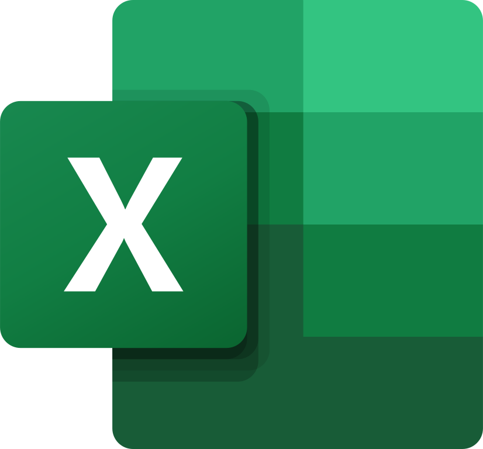

# Ferramentas

As ferramentas foram selecionadas de modo a facilitar a comunicação entre os membros da equipe e alavancar, na medida do possível, a produtividade e criatividade. Nesse sentido, as ferramentas são:

Logo | Ferramenta | Finalidade |
|---|---|---|
| | Github | Armazenamento do repositório, código e documentações associadas. |
| | Microsoft Teams | Realização das reuniões semanais. |
| | VSCode | Editor de texto/código através do qual foi construída a gitpages e as documentações. |
| | Youtube | Local de armazenamento das gravações das reuniões. |
| | Microsoft Excel | Utilizado para produzir o cronograma. |

Tabela 1: Ferramentas empregada no projeto (Fonte: autor, 2023). 

## Bibliografia

[1] Wiki Requisitos - Planejamento - Ferramentas. Disponível no [link](https://requisitos-de-software.github.io/2022.1-TikTok/ferramentas/). Acesso em: 23 de abril de 2023.