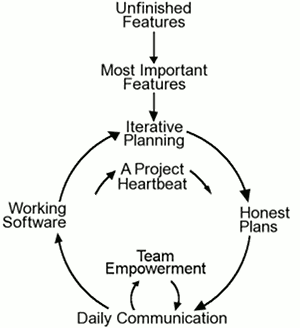

# Metodologia 

## 1. Introdução
A metodologia pode ser descrita como um conjunto de estratégias utilizadas para a realização de um determinado processo como um todo, desde o planejamento até o fim de sua execução. Portanto, com o intuito de organizar e efetuar apropriadamente as ações do grupo, baseamo-nos em dois métodos: o Scrum e o Extreme Programming.

## 2. Metodologias utilizadas
### 2.1. Extreme Programming
No Extreme Programming *(Figura 1)*, o foco está na agilidade da produção e na manutenção do que é produzido. Dessa forma, por meio do planejamento e da padronização do código torna-se possível um feedback rápido e uma melhor organização.

**Figura 1:** Processo de desenvolvimento do Extreme Programming (Fonte: WELLS, Don; 2009).

Nesse sentido, adaptamos a programação em pares para uma dinâmica na qual o autor e o revisor de um determinado artefato se comunicam de forma presencial ou remota durante a semana (sprint), trocam ideias e sugestões, realizam as alterações necessárias - até o prazo final para a entrega do artefato, como especificado no [cronograma](cronograma.md).

As tarefas mais complexas, i. e., que irão exigir maior nível de detalhes, mais pesquisas e tempo empreendido (e. g., guia de estilo, análise de tarefas, perfil de usuário), serão realizadas em duplas, onde a dupla pode e deve manter contato constante com o seu respectivo revisor durante a sprint.

### 2.2. Scrum
O método Scrum pode ser definido como um aglomerado de bons costumes que devem perdurar durante o processo de desenvolvimento *(Figura 2)* de um projeto no qual se desconhece a princípio todas as etapas. Além disso, é um método que propõe uma atividade cíclica: as sprints. As sprints são um agrupamento de atividades que devem ser realizadas durante um certo período, no caso, de uma semana.

**Figura 2:** Processo de desenvolvimento do Scrum (Fonte: Scrum.org).

Uma sprint possui três etapas que devem ser ressaltadas:

- Planning: reunião na qual a equipe se organiza e identifica as atividades que devem ser realizadas.
- Review: análise do progresso das atividades como um todo, que, no caso, o review é feito na mesma reunião do planning da próxima sprint.
- Status: reuniões secundárias que são realizadas entre os dois eventos citados acima, tratam-se de uma troca rápida de informações em respeito ao andamento do projeto.

Condensamos a etapa de planning e review em uma única reunião semanal, prevista para toda segunda-feira às 10:30, podendo ser remarcada conforme a necessidade do grupo. A etapa de status se transformou em um grupo no WhatsApp (como especificado nas [ferramentas](ferramentas.md)), com todos os integrantes do projeto, onde discutimos questões rápidas sobre a situação do projeto.

## 3. Política de commits
A branch principal é protegida, dessa forma, deve-se sempre abrir um pull request para qualquer alteração, seja ela de pequena ou de maior escala. Ao revisar um pull request, lembre-se de que as alterações posterior ao levantamento daquela branch em questão são incluídas no merge. Portanto, revise, realize as alterações necessárias e aprove a revisão e execute o merge.

Uma branch deve ser criada para resolver um problema específico, e deve ser nomeada de forma que a vicissitude em questão seja reconhecível. Além disso, ao findar o processo do pull request, caso não haja a necessidade de se utilizar mais aquela branch naquele momento, delete-a. 

## 4. Conclusão
Usando os métodos Scrum e Extreme Programming como inspiração, teremos uma reunião semanal e um grupo para a rápida troca de informações. Além disso os integrantes do grupo podem realizar uma chamada de vídeo para a realização de tarefas, que são mais trabalhosas ou mais complexas. Por fim, graças a nossa política de commits, cada tarefa deve, necessariamente, ser revisada antes de ser incluída na git page do projeto.

## Bibliografia
**Bourque and R.E. Fairley, eds.**. Guide to the Software Engineering Body of Knowledge, Version 3.0, IEEE Computer Society, 2014; www.swebok.org.

**SUTHERLAND, Jeff; SCHWABER, Ken; BEEDLE, Mike**. Scrum - What is scrum?. Disponível [aqui](https://www.scrum.org/learning-series/what-is-scrum). Acesso em: 09 de junho de 2023.

**BECK, Kent**. Extreme Programming. Disponível [aqui](http://www.extremeprogramming.org/). Acesso em: 09 de junho de 2023.

**SILVA, Davi; SOUZA, Nícolas**. Liches: Metodologia. Disponível [aqui](https://interacao-humano-computador.github.io/2022.2-Lichess/planejamento/metodologias/). Acesso em: 06 de junho de 2023.

## Histórico de versão
| Versão | Data | Descrição | Autor(es) | Revisor(es) |
| --- | --- | --- | --- | --- |
|  `1.1`   | 15/05/2023 | Correção da Metodologia Completa | [Arthur Augusto](https://github.com/arthur-augusto) | [João Barreto](https://github.com/JoaoBarreto03) |
|  `1.2`   | 09/06/2023 | Refatoração: melhorando a bibliografia, estruturando o documento em tópicos, adicionando links no texto, especificando melhor como faremos algumas dinâmicas - seguindo os feedbacks do grupo 04 de IHC. | [Bruno Martins](https://github.com/gitbmvb) | [João Barreto](https://github.com/JoaoBarreto03) |