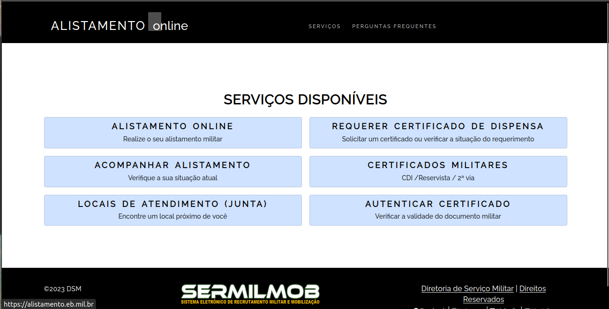

# Site escolhido

## 1. Introdução

Durante o processo de avaliação dos sites, os membros do grupo fizeram diversas buscas por plataformas que poderiam ser melhoradas e que tivessem funcionalidades importantes, nas quais poderiam ser reformuladas e entregues de uma maneira mais eficiente para o usuário. Com base nisso, foram analisados 5 sites, que se encontram na aba dos [sites avaliados](sites_avaliados.md).

## 2. Site escolhido

Após uma reunião com a equipe, foi decidido que o site do [Alistamento Militar](./avaliacoes/alistamento.md) seria o objeto de estudo, uma vez que ele atende aos seguintes critérios:

- Site ainda não foi trabalhado na disciplina de IHC;
- O site apresenta problemas de interface;
- O site possui diversas funcionalidades que permitem uma análise aprofundada por parte dos membros do grupo;
- O site possui área de cadastro e login;
- O site é utilizado por diversas pessoas de forma constante, principalmente no período de alistamento;
- O site possui problemas que geram confusão nos usuários.

## 3. Apresentação do site

O site Alistamento Militar é um sítio criado para o Exército Brasileiro para facilitar o processo de alistamento, possibilitando a realização de diversas funcionalidades, como:

- Realizar o alistamento militar;
- Acompanhar o processo de alistamento;
- Gerar o boleto do processo para pagamento;
- Gerar os documentos que fazem jus ao usuário, com relação ao serviço militar;
- Verificar a autenticidade de certificados militares

    
    
**Figura 1:** Página principal do site "Alistamento Miltar". (**Fonte:** BARRETO, João; 2023)

## 4. Conclusão

Com todos os critérios mencionados atendidos, o site se sobressaiu com relação aos demais [sites avaliados](sites_avaliados.md) e será o objeto de estudo do grupo na disciplina de IHC.

## Referências

**BARBOSA, Simone; DINIZ, Bruno**. Interação Humano-Computador. Editora Elsevier, Rio de Janeiro, 2010.

**MACHADO, Maurício; SOUZA, Nícolas**. Lichess: Cronograma. Disponível [aqui](https://interacao-humano-computador.github.io/2022.2-Lichess/planejamento/app_selected/). Acesso em: 26 de junho de 2023.

## Histórico de versão
| Versão | Data | Descrição | Autor(es) | Revisor(es) |
| --- | --- | --- | --- | --- |
|  `1.0`   | 26/06/2023 | Criação inicial do documento do site escolhido | [João Barreto](https://github.com/JoaoBarreto03) |  [Bruno Martins](https://github.com/gitbmvb) |